# Déraison Assurances : un *intent engine*, en 5 approches

[🇫🇷 Français](LISEZMOI.md) · [🇬🇧 English](README.md)

📖 Mode d'emploi : [🇫🇷 MODEDEMPLOI](MODEDEMPLOI.md) · [🇬🇧 USERGUIDE](USERGUIDE.md)

> « Mes collègues me demandent **comment on fait** un moteur de détection
> d'intention. », Ce dépôt répond, en montrant **cinq façons** de le faire,
> côte à côte, sur un cas concret : le chatbot d'aiguillage d'une compagnie
> d'assurance (fictive) qui oriente ses clients au **téléphone** comme
> à l'**écrit**.

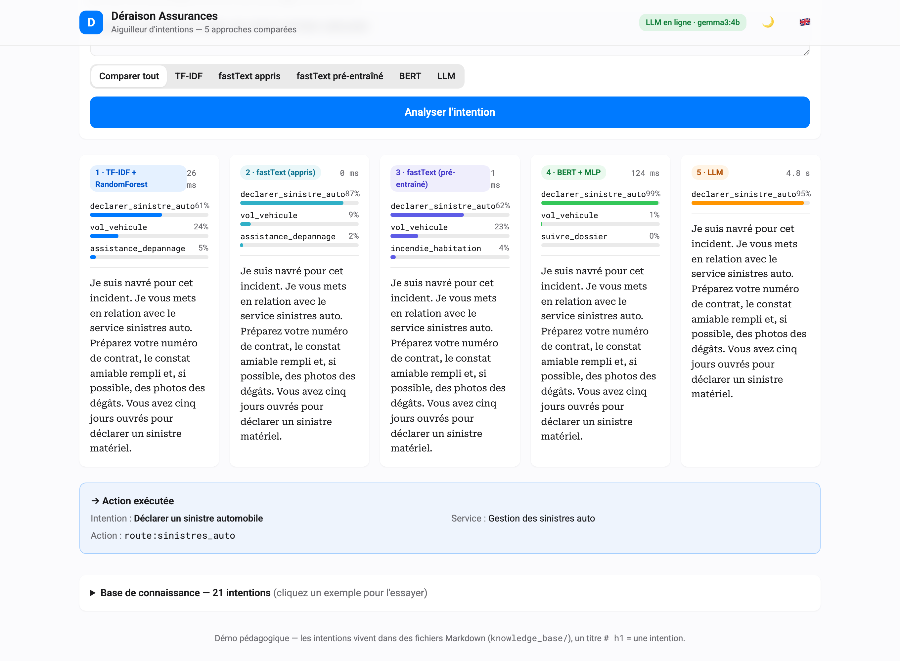

Un client dit *« j'ai eu un accident ce matin, ma voiture est cabossée »* et le
système doit comprendre l'**intention** (`declarer_sinistre_auto`), aiguiller
vers le bon **service** et, idéalement, extraire les **informations utiles**
(urgence, type de bien). Cinq moteurs font ce travail, une **traversée
volontaire de l'histoire du NLP**, du sac-de-mots au LLM génératif :

| # | Moteur | Représentation | Classifieur | Le compromis |
|---|--------|----------------|-------------|--------------|
| 1 | <span style="color:#007AFF">■</span> **TF-IDF** | n-grammes creux (car./mots) | **Random Forest** | Instantané, minuscule. Mémorise les formes de surface. |
| 2 | <span style="color:#1D8C8D">■</span> **fastText (appris)** | sous-mots **appris sur nos exemples** | softmax fastText | Léger ; un cran au-dessus du sac-de-mots. |
| 3 | <span style="color:#28CD41">■</span> **fastText (pré-entraîné)** | vecteurs **cc.fr.300** (Common Crawl) | régression logistique | Transfert : sait déjà que *voiture* ≈ *véhicule*. |
| 4 | <span style="color:#AF52DE">■</span> **BERT** | embeddings contextuels (**SBERT**) | **MLP PyTorch** | Comprend le sens ; gagne sur les paraphrases. Local. |
| 5 | <span style="color:#FF3B30">■</span> **LLM** | (prompt) | **Gemma / qwen** via Ollama, **JSON strict** | Zéro entraînement, extrait les slots. Le plus lent, le plus malin. |

📊 Le comparatif détaillé et sourcé (benchmarks, RGPD, coûts) : **[`PROS_CONS.md`](PROS_CONS.md)**.
📖 Le mode d'emploi pas à pas (avec captures) : **[`MODEDEMPLOI.md`](MODEDEMPLOI.md)**.
🍳 Le cookbook exécutable : **[`EXAMPLES.md`](EXAMPLES.md)**.
📐 Le standard de code suivi partout : **[`CODING.md`](CODING.md)**.

## Pourquoi ce projet : l'objectif pédagogique

C'est un **artefact d'enseignement Data Science / Machine Learning / IA**. Le
but n'est pas de livrer le meilleur classifieur ; c'est de faire **ressentir,
en un écran**, à des collègues qui ne pratiquent *pas* le ML, l'idée la plus
importante du NLP appliqué : **la représentation compte plus que le
classifieur.**

Lisez le tableau des moteurs de haut en bas et vous parcourez l'histoire du
domaine :

1. **Sac-de-mots (TF-IDF)** : on compte des n-grammes ; le modèle voit des
   *chaînes*, pas du *sens*. Un synonyme jamais vu lui est invisible.
2. **Sous-mots appris (fastText, sur nos données)** : le modèle commence à
   rapprocher les mots proches, à partir de quelques centaines d'exemples.
3. **Vecteurs pré-entraînés (fastText cc.fr.300)** : transfert : la
   connaissance de milliards de mots de français est versée gratuitement.
4. **Embeddings contextuels (BERT/SBERT) + réseau de neurones** : du sens qui
   dépend du contexte, plus un classifieur non-linéaire.
5. **LLM génératif (Gemma)** : aucun entraînement ; du raisonnement à partir
   d'un prompt et (c'est unique) l'extraction de *slots* structurés.

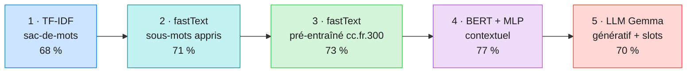

Le comparateur montre ensuite le **gain** avec des chiffres réels mesurés (pas
des opinions) : sur un jeu de test **riche en paraphrases**, l'exactitude tenue
à l'écart monte **68 % → 71 % → 73 % → 77 %** des moteurs 1→4 et le LLM ajoute
l'extraction de slots. Et surtout, il montre les **réserves honnêtes** qui
comptent pour un(e)
praticien(ne) : l'incertitude d'échantillonnage (**violin plots** bootstrap), la
variance train/test (**validation croisée** k-fold), la mauvaise calibration
des réseaux de neurones (trop sûrs d'eux hors-périmètre) et la confidentialité
(pourquoi tout tourne en local). But : qu'un(e) collègue non-ML reparte en
comprenant *pourquoi* choisir une approche plutôt qu'une autre.

---

## Le principe : la connaissance vit dans du Markdown

**Un titre `# h1` = une intention.** Un(e) expert(e) métier ajoute une intention
en écrivant du Markdown dans `knowledge_base/`, **sans toucher au code** :

```markdown
# declarer_sinistre_auto

> **Titre** : Déclarer un sinistre automobile
> **Service** : Gestion des sinistres auto
> **Action** : route:sinistres_auto

## Exemples
- J'ai eu un accident de voiture
- Mon pare-brise est fissuré
- On m'a rentré dedans au feu rouge

## Réponse
Je vous mets en relation avec le service sinistres auto…
```

Les `## Exemples` servent de **données d'entraînement** à TF-IDF et BERT, et
d'exemples **few-shot** au LLM. La `## Réponse` est le script lu/affiché. Format
complet : [`knowledge_base/_FORMAT.md`](knowledge_base/_FORMAT.md).

---

## Installation

Pré-requis : **Python ≥ 3.10**. Pour le moteur LLM (et le repli d'embeddings
BERT), **Ollama** en local.

### 1. Ollama (pour le moteur LLM)

- macOS 🍎 : `brew install ollama` (installez `brew` via [brew.sh](https://brew.sh/)), puis `ollama serve`
- Ubuntu 🐧 : `curl -fsSL https://ollama.com/install.sh | sh`
- Windows 🪟 : `winget install Ollama.Ollama`

Puis récupérez les modèles :

```bash
ollama pull gemma3:4b           # moteur LLM (compact + rapide ; ~5 s/appel à chaud)
ollama pull nomic-embed-text    # repli d'embeddings pour le moteur BERT
```

### 2. Le projet

```bash
python -m venv .venv
source .venv/bin/activate        # Windows 🪟 : .venv\Scripts\activate
pip install -r requirements.txt

# Optionnel — le chemin SBERT + MLP PyTorch du moteur BERT (~2 Go) :
pip install "sentence-transformers>=3.0.0" torch
# Optionnel — le moteur fastText pré-entraîné : télécharger cc.fr.300 (~4,5 Go au téléchargement, ~7 Go sur disque) :
python scripts/download_fasttext.py
# Optionnel — la couche d'évaluation (DeepEval ; Giskard exige Python ≤ 3.11) :
pip install ".[eval]"
```

> La démo **se dégrade gracieusement** : sans `sentence-transformers`+`torch`,
> le moteur BERT est indisponible ; sans `cc.fr.300.bin`, le fastText
> pré-entraîné est masqué ; sans Ollama, le LLM est masqué. TF-IDF et fastText
> appris tournent toujours.

---

## Démarrage rapide

### L'interface web (le joli front)

```bash
./start.sh                       # ou : uvicorn intent_engine.api:app --port 8000
# puis ouvrez http://localhost:8000
```

Écrivez une demande, choisissez un moteur (ou **Comparer tout**) et voyez les
prédictions des 5 moteurs côte à côte : barres de confiance, latences, slots
extraits et action d'aiguillage. Parcourez la base de connaissance pour essayer
des exemples.

### En ligne de commande

```bash
python -m intent_engine intents                       # lister les intentions
python -m intent_engine compare "j'ai eu un accident, ma voiture est cabossée"
python -m intent_engine classify --engine tfidf "je veux résilier"
python -m intent_engine execute "il me faut une prise en charge pour l'hôpital"
```

Exemple de sortie de `compare` (sur une paraphrase, voyez les moteurs lexicaux
s'abstenir tandis que les sémantiques trouvent) :

| Moteur | Prédiction | Confiance | CPU / appel |
|--------|-----------|:---------:|------------:|
| `tfidf` | *(s'abstient)* |, | ~50 ms |
| `fasttext_custom` | `declarer_sinistre_auto` | 0.33 | ~33 µs |
| `fasttext_pretrained` | *(s'abstient)* |, | ~250 µs |
| `bert` | `declarer_sinistre_auto` | **0.98** | ~20 ms |
| `llm` | `declarer_sinistre_auto` | **0.95** | ~4,7 s |

Le LLM extrait en plus des **slots** (`type_bien: auto`, `urgence: haute`) ce
qu'aucun classifieur ne fait. Les deux moteurs lexicaux s'abstiennent ou passent
tout juste la barre sur cette paraphrase ; les sémantiques sont confiants. *Voilà*
la leçon en une requête.

---

## Résultats mesurés (21 intentions, 210 paraphrases tenues à l'écart)

Reproductibles : `python -m eval.harness` (exactitude/latence) et
`python -m eval.crossval` (distributions bootstrap + validation croisée).

Le jeu de test est volontairement **riche en paraphrases** (faible recouvrement
lexical avec l'entraînement) : il mesure la **généralisation**, pas la
mémorisation du vocabulaire, c'est là que la représentation prouve sa valeur.

| # | Moteur | Exactitude | CPU / appel | Slots |
|---|--------|-----------:|------------:|:-----:|
| 1 | <span style="color:#007AFF">■</span> **TF-IDF + RandomForest** | 68 % | ~50 ms | ❌ |
| 2 | <span style="color:#1D8C8D">■</span> **fastText (appris)** | 71 % | ~33 µs | ❌ |
| 3 | <span style="color:#28CD41">■</span> **fastText (pré-entraîné)** | 73 % | ~250 µs | ❌ |
| 4 | <span style="color:#AF52DE">■</span> **BERT (SBERT + MLP)** | 77 % | ~20 ms | ❌ |
| 5 | <span style="color:#FFCC00">■</span> **qwen2.5:3b · zero shot** | 63 %¹ | ~2 s | ✅ |
| 6 | <span style="color:#FF9500">■</span> **qwen2.5:3b · few shots** | 64 %¹ | ~2 s | ✅ |
| 7 | <span style="color:#FF8AC4">■</span> **gemma3:4b · zero shot** | 68 %¹ | ~5 s | ✅ |
| 8 | <span style="color:#FF3B30">■</span> **gemma3:4b · few shots** | 70 %¹ | ~5 s | ✅ |

<sup>**Slots** = champs structurés extraits en plus de l'intention (urgence, type de bien, numéro de contrat…), prêts pour un CRM/SVI aval ; seul le LLM génératif le fait. Les quatre scores classifieurs sont l'exactitude argmax brute de skore sur les **210 paraphrases tenues à l'écart** (sans abstention) ; ¹ les quatre configs LLM sont mesurées sur ces **mêmes 210** avec leur sortie JSON native. Les couleurs sont les mêmes dans toutes les figures du dépôt.</sup>

> **Une surprise de latence à remarquer.** Le *classique* `TF-IDF + RandomForest`
> (~50 ms) est en fait le **moteur non-LLM le plus lent** : les centaines d'arbres
> de la forêt coûtent plus cher que la tête MLP de BERT à deux produits matriciels
> (~20 ms) ou la recherche de vecteurs de fastText (~33 µs). « À l'ancienne » ne
> veut pas dire « rapide » et « neuronal » ne veut pas dire « lent » : on mesure,
> on ne suppose pas. (Temps CPU via `process_time`, insensible aux autres apps -
> voir `eval/bench.py` ; le chiffre du LLM est le calcul propre d'Ollama.)

**Les distributions, pas juste les points.** Les quatre classifieurs
*entraînables* passent une **validation croisée répétée 5 blocs** : 5 blocs ×
5 mélanges = **25 mesures réelles** chacun (apprendre sur 4/5 des K = 21
intentions / N = 1008 exemples, tester sur le 1/5 restant), scorés par **skore**
et tracés en **violons** lisses. Les quatre configs LLM sont zéro-shot : rien
n'est entraîné, donc chacune est *un seul* nombre held-out, un **Dirac** tracé
en une ligne horizontale.
Chaque moteur garde la couleur qu'il porte dans le tableau des résultats
ci-dessus et dans toutes les autres figures du dépôt :

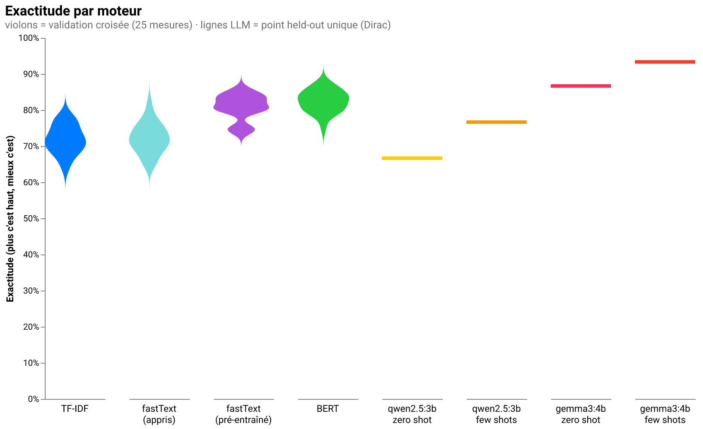

> **Deux angles, une histoire honnête.** Sur les paraphrases ci-dessus,
> l'exactitude held-out monte 68 → 71 → 73 → 77 %. En **validation croisée** sur
> les exemples in-distribution de la KB le même ordre tient (72 → 75 → 76 →
> 78 %), un peu plus haut car les blocs ressemblent davantage à leur texte
> d'entraînement : le lexical s'en sort quand le test ressemble à l'entraînement
> et perd le plus sous le changement de distribution (paraphrases), la raison
> d'être des représentations sémantiques.
>
> Filet hors-périmètre : sur 15 phrases hors sujet, TF-IDF s'abstient ~93 % du
> temps ; le réseau BERT est plus sûr de lui (~73 % après réglage du seuil) -
> une vraie leçon sur la **calibration des réseaux de neurones**. Analyse
> complète et sources dans [`PROS_CONS.md`](PROS_CONS.md).
>
> **Sur le choix du LLM, et un gros LLM bat-il BERT ?** Le compact `gemma3:4b`
> par défaut (~5 s à chaud) atteint **70 %**, *sous* les 77 % de BERT : un petit
> LLM local troque de l'exactitude contre de la vitesse, son vrai atout étant
> l'**extraction de slots + le zéro-shot**. Mais **la taille compte** : sur le
> même jeu held-out, un plus gros modèle local reprend la tête :
> **`gemma4:e4b-mlx` 79 %** (run complet, 210 phrases) et **`gemma4:12b-mlx`
> ~78 %** (run partiel, 166/210 phrases, le classement est solide mais la valeur
> exacte est un plancher), tous deux devant les 77 % de BERT. Le petit modèle
> était simplement *sous-dimensionné* ; la hiérarchie tient et les plus gros
> modèles génératifs repassent en tête, au prix réel de secondes par appel contre
> ~20 ms pour BERT. On choisit selon le besoin (`INTENT_LLM_MODEL` change le
> modèle). *Jeu held-out auto-généré, marges de quelques points : lire le
> classement, pas les décimales.*

### Où chaque moteur se trompe ? Matrices de confusion

Un chiffre d'exactitude cache *comment* un moteur échoue. Chaque carte de
chaleur compte, pour chaque intention réelle (lignes), l'intention prédite
(colonnes), plus une colonne `Abstention` pour les cas « transfert humain ». La
diagonale, c'est là où le moteur a raison ; le hors-diagonale, ses confusions.
Chaque matrice porte la couleur de son moteur (blanc vers couleur). Dans l'ordre,
la diagonale se resserre : les moteurs lexicaux s'éparpillent et s'appuient
beaucoup sur `Abstention`, BERT décroche une diagonale quasi nette, et les
configs LLM se resserrent encore avec un meilleur modèle et des exemples few-shot.

| | |
|---|---|
| 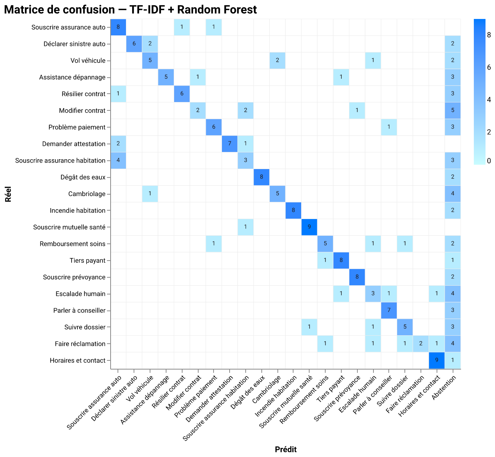 | 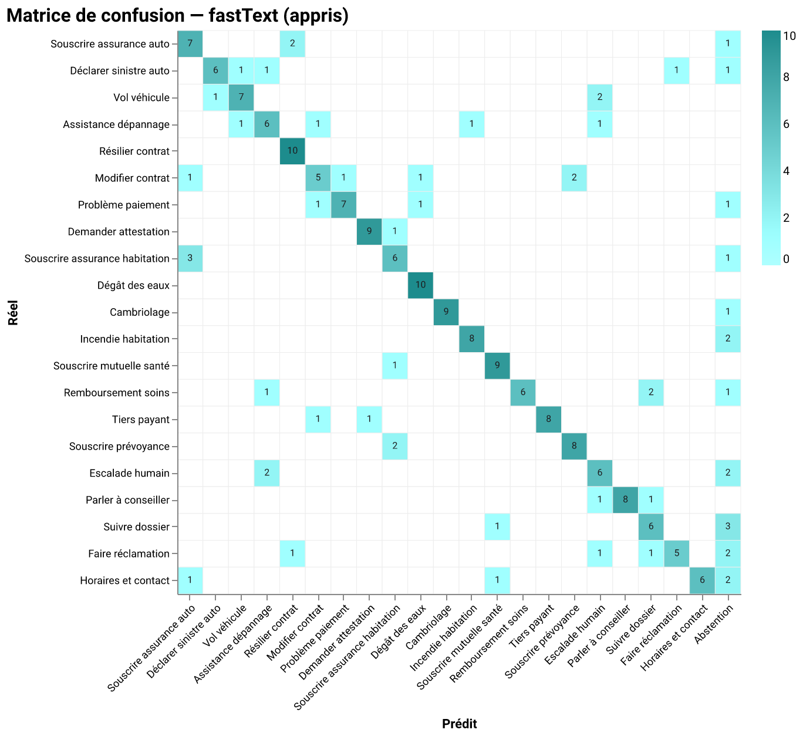 |
| 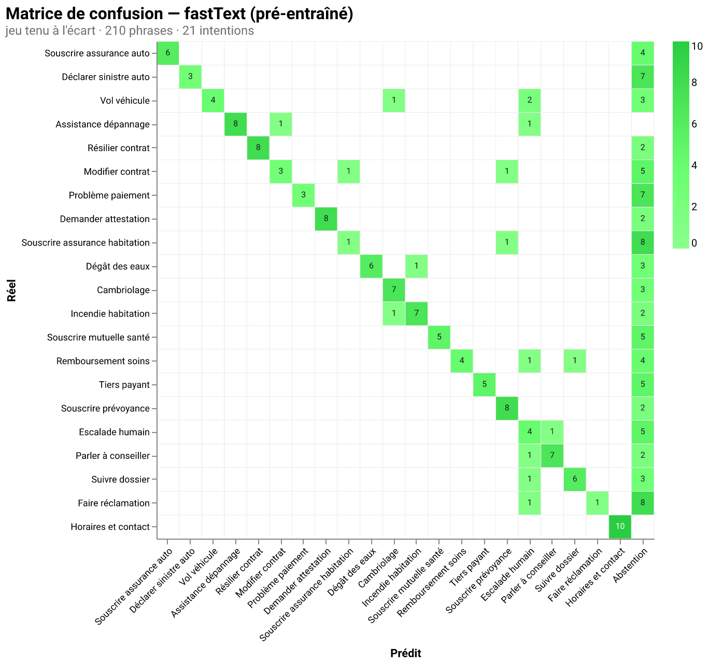 | 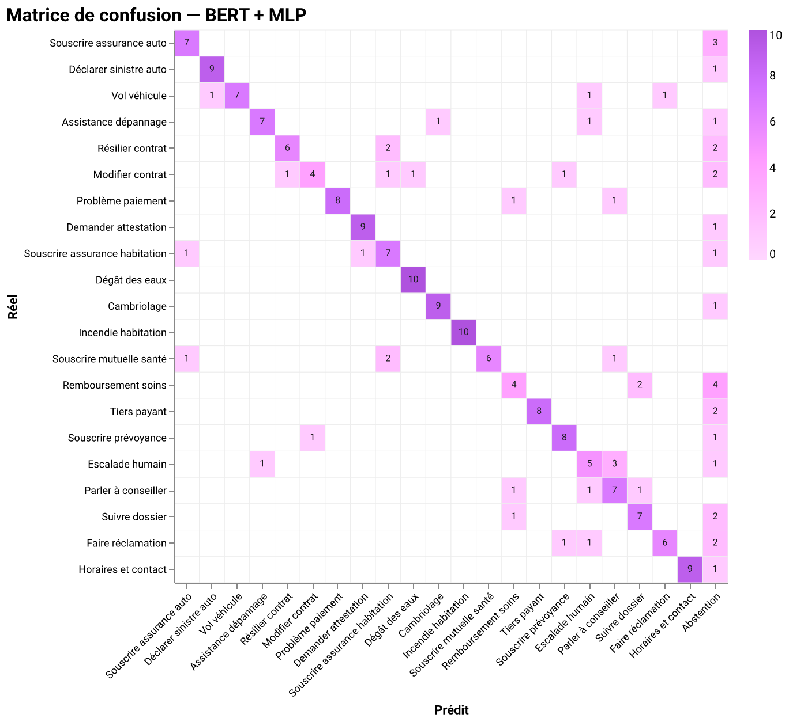 |
| 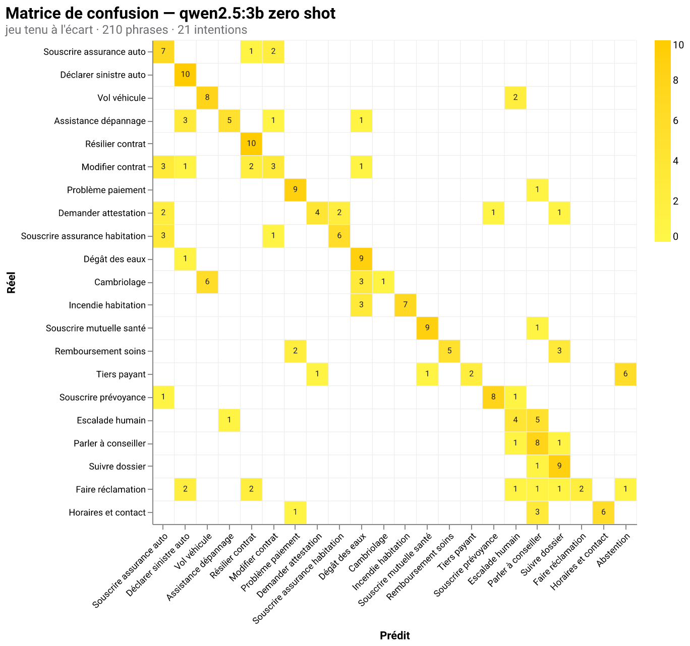 | 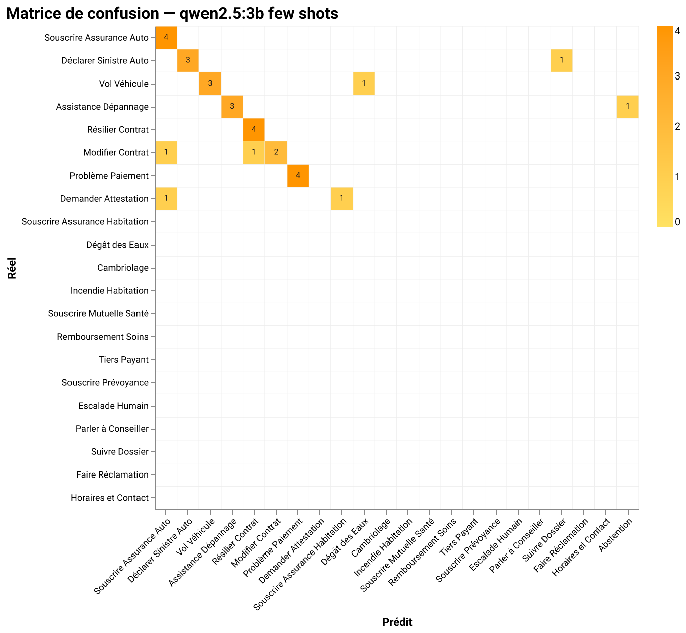 |
| 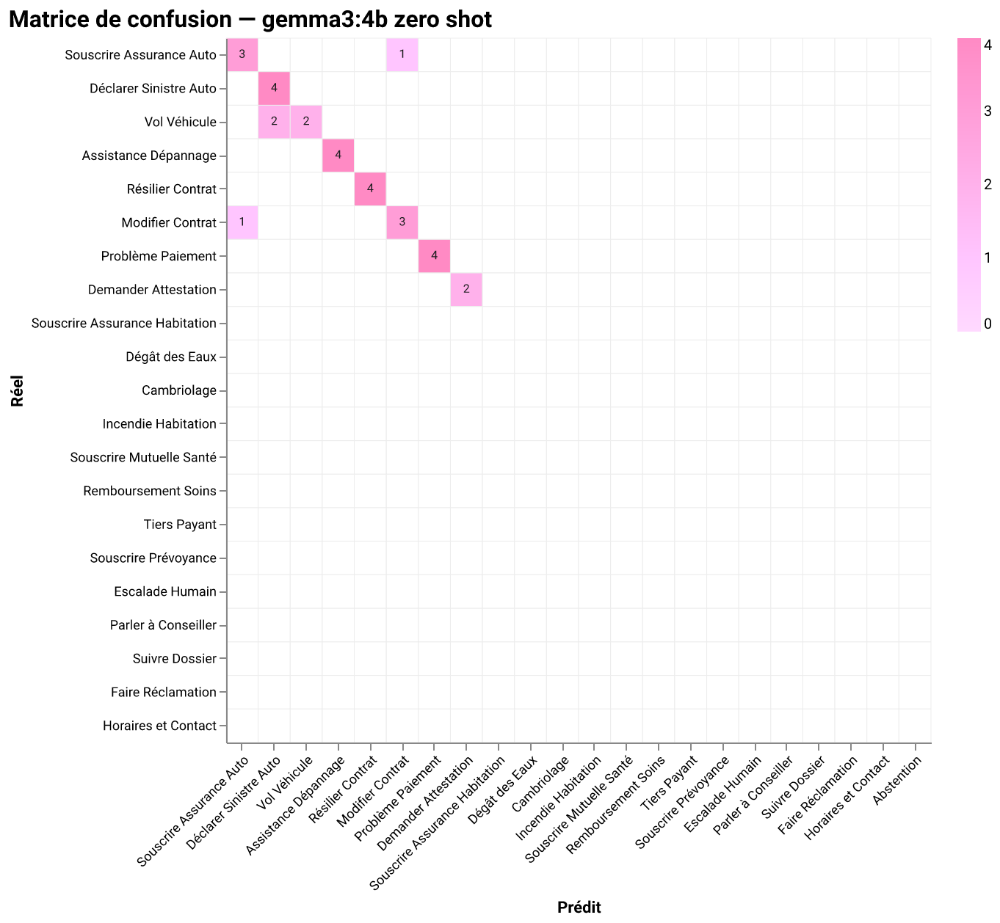 | 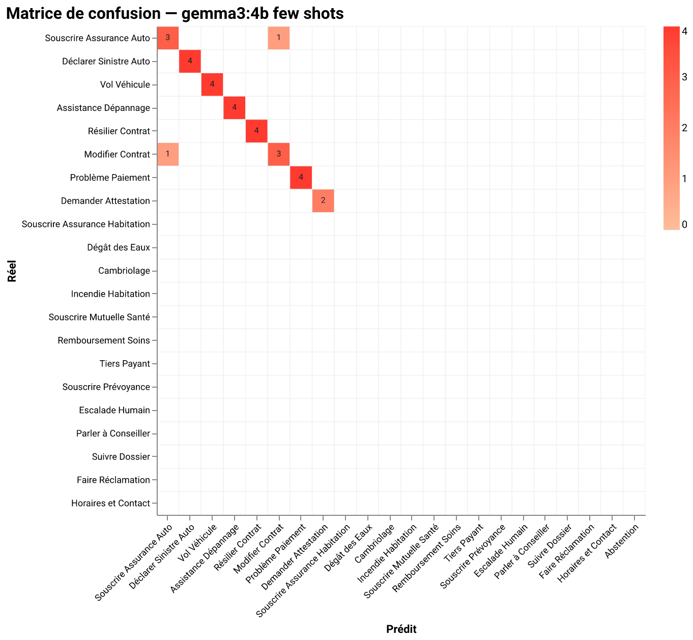 |

On régénère les huit avec `python -m eval.confusion`.

### Un modèle plus gros ou quelques exemples ? Un 2×2 sur le LLM

La leçon *représentation* ci-dessus parle du classifieur. Celle-ci parle du
**LLM**, selon deux réglages indépendants, le **modèle** (un petit `qwen2.5:3b`
vs le plus gros `gemma3:4b`) et les **exemples** (zéro-shot vs trois exemples
few-shot, sur des phrases **fraîches** hors jeu de test, donc sans tricher), à
prompt (soigné) constant :

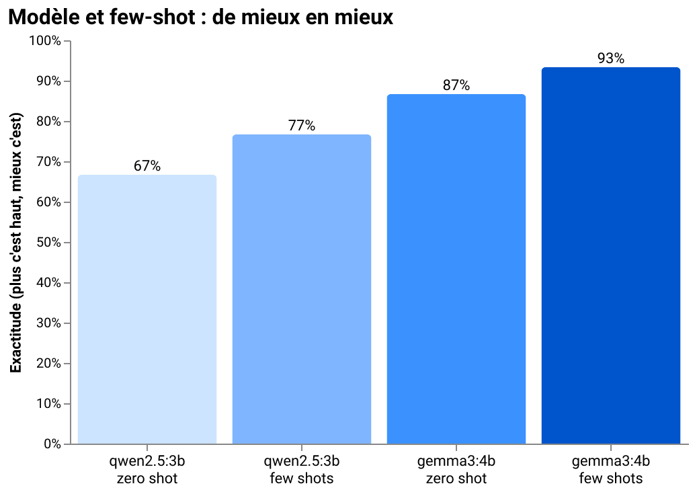

> **Le modèle fait le saut ; le few-shot ajoute un petit plus.**
> L'exactitude grimpe **63 → 64 → 68 → 70 %** : passer du petit modèle au plus
> gros, c'est le mouvement le plus net ; ajouter une poignée d'exemples few-shot
> gagne un point ou deux de plus sur chaque modèle. La morale qu'un(e)
> praticien(ne) reconnaît : *prends d'abord un modèle plus fort, puis grappille
> les derniers points avec des exemples bien choisis ; encore faut-il qu'ils
> soient frais, sinon on ne mesure que de la fuite.* (Scoré sur les 210 tenus à
> l'écart ; prédictions mises en cache par config dans `eval/.llm_shootout/`.)

---

## Architecture

La base de connaissance Markdown alimente tous les moteurs ; les cinq
implémentent le même contrat `IntentEngine`, donc le routeur, l'API, la CLI et
le front les traitent à l'identique. Seuls la **représentation et le
classifieur** changent.

```mermaid
flowchart LR
    KB["📄 knowledge_base/<br/>Markdown, h1 = intention"] --> Moteurs

    subgraph Moteurs["Cinq moteurs — même contrat IntentEngine"]
        direction TB
        E1["1 · TF-IDF · Random Forest"]
        E2["2 · fastText · appris"]
        E3["3 · fastText · pré-entraîné"]
        E4["4 · BERT · SBERT + MLP"]
        E5["5 · LLM · Gemma · JSON"]
    end

    Moteurs --> R["router.py<br/>registre · comparaison · exécution"]
    R --> API["api.py · FastAPI"]
    R --> CLI["cli.py · terminal"]
    API --> WEB["web/ — vanilla JS + Tailwind"]

    style KB fill:#FFEACC,stroke:#FF9500,color:#1C1C1E
    style R fill:#F8F8F8,stroke:#808080,color:#1C1C1E
    style E1 fill:#CCE4FF,stroke:#007AFF,color:#1C1C1E
    style E2 fill:#C4F1F1,stroke:#1D8C8D,color:#1C1C1E
    style E3 fill:#D4F5D9,stroke:#28CD41,color:#1C1C1E
    style E4 fill:#EFDCF8,stroke:#AF52DE,color:#1C1C1E
    style E5 fill:#FFD8D6,stroke:#FF3B30,color:#1C1C1E
    style API fill:#CCE4FF,stroke:#007AFF,color:#1C1C1E
    style CLI fill:#CCE4FF,stroke:#007AFF,color:#1C1C1E
    style WEB fill:#CCE4FF,stroke:#007AFF,color:#1C1C1E
```

Modules-clés : `kb.py` (parseur), `base.py` (contrats), `tfidf_engine.py`,
`fasttext_engine.py`, `embeddings.py` + `mlp.py`, `bert_engine.py`,
`llm_engine.py` + `ollama_client.py`, `router.py`, `api.py`, `cli.py` ;
`eval/` contient les datasets, le banc d'essai, `crossval.py`, `violin.py` et
les intégrations DeepEval/Giskard.

Les cinq moteurs partagent la même « tuyauterie » : on voit la qualité bouger
le long de la progression, seule la représentation change.

---

## Tests & évaluation

```bash
pytest -m "not slow"                   # suite rapide (déterministe, sans réseau)
pytest                                 # suite complète (BERT réel + Ollama)
python -m eval.harness                 # exactitude/latence de tous les moteurs
python -m eval.crossval                # distributions bootstrap + k-fold
python -m eval.violin                  # génère le violon dans docs/img/
```

---

## Confidentialité

Le **moteur d'intention** tourne **en local** (scikit-learn, fastText & SBERT
auto-hébergés, LLM via Ollama) : le texte d'une requête ne quitte pas la
machine, un choix délibéré, car en assurance une seule phrase peut être une
**donnée de santé sensible** au sens de l'art. 9 RGPD. *« Il me faut une prise
en charge pour l'Institut de cancérologie »* révèle un diagnostic de cancer ;
l'envoyer à un LLM cloud exfiltrerait exactement la donnée que la loi protège
le plus. Ici, elle reste sur la machine.

Détails et discussion RGPD dans [`PROS_CONS.md`](PROS_CONS.md#le-point-qui-décide-en-assurance--rgpd--données-de-santé).


