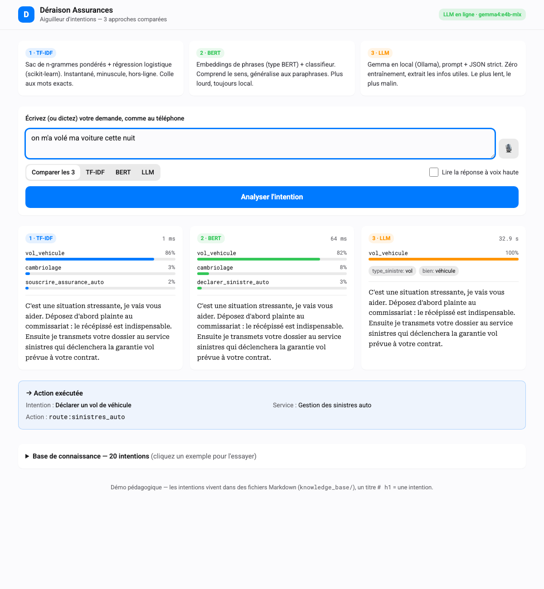

# Mode d'emploi — moteur d'intentions Déraison Assurances

[🇫🇷 MODEDEMPLOI](MODEDEMPLOI.md) · [🇬🇧 USERGUIDE](USERGUIDE.md) — 🏠 [🇫🇷 LISEZMOI](LISEZMOI.md) · [🇬🇧 README](README.md)

Une prise en main pas à pas de la démo : l'interface web, la voix, la ligne de
commande, et comment lire les résultats. Pour l'installation et l'architecture,
voir [`LISEZMOI.md`](LISEZMOI.md) ; pour le comparatif des approches,
[`PROS_CONS.md`](PROS_CONS.md).

---

## 1. Lancer l'application

```bash
./start.sh                 # ou : uvicorn intent_engine.api:app --port 8000
```

Ouvrez <http://localhost:8000>. Vous arrivez sur l'écran d'accueil :


De haut en bas :
- **En-tête** — la marque, et un badge qui indique honnêtement l'état du moteur
  LLM : vert *« LLM en ligne · gemma4:e4b-mlx »* quand Ollama répond, gris
  *« LLM hors ligne »* sinon (le bouton LLM est alors désactivé).
- **Trois cartes** — un rappel en une ligne de chaque approche (TF-IDF / BERT / LLM).
- **Zone de saisie** — un champ texte, un bouton micro, un sélecteur de moteur,
  un interrupteur « lire à voix haute », et le bouton **Analyser l'intention**.

---

## 2. Poser une demande

Tapez une phrase de client — comme entendue au téléphone — par ex.
*« j'ai eu un accident ce matin, ma voiture est cabossée »*.

Choisissez un mode avec le contrôle segmenté :
- **Comparer les 3** (défaut) — lance les trois moteurs côte à côte.
- **TF-IDF** / **BERT** / **LLM** — lance un seul moteur.

Cliquez **Analyser l'intention**.

### Lire le comparateur



Chaque moteur a une carte qui montre :
- sa **pastille colorée** (1·TF-IDF bleu, 2·BERT vert, 3·LLM orange) et sa
  **latence** (en haut à droite) — comparez TF-IDF en ~1 ms au LLM en ~20 s ;
- des **barres de confiance** pour les intentions de tête (l'identifiant + un %) ;
- la **réponse scriptée** de l'intention gagnante, en serif ;
- pour le LLM, les **slots extraits** (ex. `urgence: haute`) en petits badges.

Sous les cartes, l'encadré **Action exécutée** montre l'aiguillage concret qu'un
système aval (CRM, SVI) recevrait : intention, service, action machine, slots.

---

## 3. Le filet de sécurité « Je ne sais pas »

Si aucun moteur n'est assez confiant, l'assistant **ne devine pas**. Il le dit
franchement et **transfère à un conseiller humain** (pas l'IA). Vous verrez :

> → Je ne sais pas — transfert à un conseiller humain

C'est délibéré : en assurance, une réponse fausse mais assurée est pire qu'un
transfert honnête. Le client peut aussi le déclencher en disant *« je ne sais
pas »*, *« je suis perdu »* ou *« aucune de vos options ne me convient »* — ces
phrases correspondent à l'intention dédiée `escalade_humain`.

---

## 4. La voix — parler et être répondu

- **Dicter** (*vocal-helper*) : cliquez le micro 🎙️ et parlez ; la reconnaissance
  vocale du navigateur écrit vos mots dans le champ. (Fonctionne sous Chrome/Edge ;
  le bouton se masque si le navigateur n'a pas de reconnaissance vocale.)
- **Lire à voix haute** (*speech-helper*) : activez l'interrupteur **Lire la
  réponse à voix haute** et la réponse gagnante est prononcée en français.

Les deux utilisent l'API Web Speech intégrée au navigateur — rien n'est envoyé
à un serveur.

---

## 5. Mode sombre

L'interface suit automatiquement l'apparence de votre système (clair ou sombre) :


---

## 6. Parcourir la base de connaissance

En bas, dépliez **Base de connaissance** pour voir chaque intention, son service
cible et des phrases d'exemple. **Cliquez un exemple** pour le déposer dans le
champ de saisie et l'essayer immédiatement.


Rappel : cette liste est générée depuis les fichiers Markdown de
`knowledge_base/`. Ajoutez-y un titre `# h1` et il apparaît ici — sans toucher
au code.

---

## 7. En ligne de commande

Tout ce que fait l'application web est disponible au terminal, pratique pour une
démo en direct :

```bash
python -m intent_engine intents                       # lister les intentions
python -m intent_engine compare "je veux résilier mon assurance"
python -m intent_engine classify --engine bert "ma vitre est cassée"
python -m intent_engine execute "il me faut une prise en charge hôpital"
```

---

## 8. Dépannage

| Symptôme | Solution |
|---|---|
| Badge *« LLM hors ligne »* | Démarrez Ollama (`ollama serve`) et `ollama pull gemma4:e4b`. Le reste de l'app fonctionne. |
| BERT lent / différent | Sans `sentence-transformers`, il utilise le repli d'embeddings Ollama. `pip install "sentence-transformers>=3.0.0"` pour le chemin SBERT. |
| Le micro ne fait rien | Utilisez Chrome/Edge ; autorisez le micro ; l'API Web Speech n'existe pas partout. |
| Port déjà utilisé | `PORT=9000 ./start.sh` ou passez `--port 9000` à uvicorn. |

---

## 9. Pour aller plus loin

- [`LISEZMOI.md`](LISEZMOI.md) — installation, architecture, résultats mesurés.
- [`PROS_CONS.md`](PROS_CONS.md) — comparatif sourcé des trois approches.
- [`EXAMPLES.md`](EXAMPLES.md) — recettes Python + HTTP + CLI.
- [`knowledge_base/_FORMAT.md`](knowledge_base/_FORMAT.md) — comment ajouter une intention.
