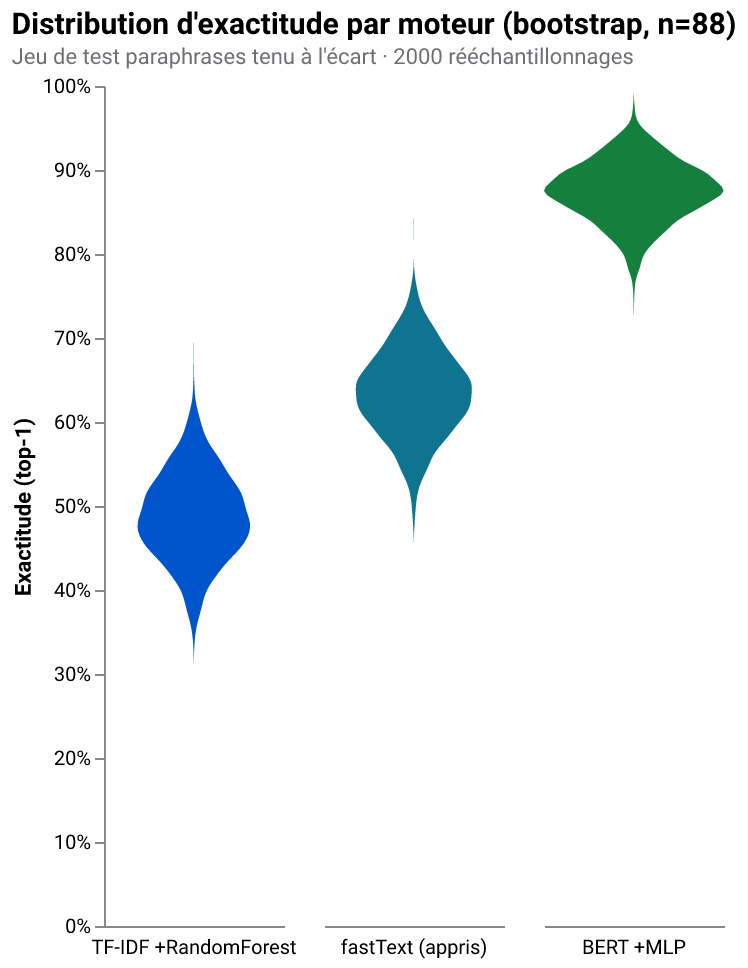

# Intent Engine — 3 approches comparées

> Grand tableau comparatif pour choisir **comment détecter l'intention** d'un
> client d'assurance : à l'ancienne (TF-IDF), avec une représentation type
> BERT, ou en « bourrin » avec un LLM. Chiffres issus de benchmarks publiés
> **et** de nos propres mesures sur ce dépôt. Sources en bas de page.

---

## En une phrase

| # | Approche | L'idée | Quand la choisir |
|---|----------|--------|------------------|
| 1 | **TF-IDF + Random Forest** | Sac de n-grammes pondérés + forêt d'arbres | Baseline instantanée, hors-ligne, explicable ; beaucoup de données, vocabulaire stable |
| 2 | **fastText appris** | Sous-mots appris sur nos exemples + softmax fastText | Léger, rapide, robuste aux fautes ; un cran de sémantique sans modèle externe |
| 3 | **fastText pré-entraîné** | Vecteurs cc.fr.300 (Common Crawl) + classifieur | Transfert de sens gratuit, peu d'exemples ; sait déjà que *voiture* ≈ *véhicule* |
| 4 | **BERT + MLP** | Phrase → vecteur contextuel (SBERT) → MLP PyTorch | Robustesse maximale aux paraphrases, multilingue ; le meilleur non-génératif |
| 5 | **LLM + prompt JSON** | On décrit les intentions au modèle, il répond en JSON strict | Démarrage à froid (zéro donnée), extraction de slots, catalogue qui bouge vite |

> Note sur le **grand tableau théorique** ci-dessous : il oppose les trois
> *archétypes* (lexical, embeddings, LLM). Les deux moteurs fastText sont le
> pont concret entre lexical et embeddings — fastText *appris* est proche du
> lexical (sous-mots sur nos données), fastText *pré-entraîné* bascule côté
> embeddings (transfert). BERT est l'embedding contextuel abouti.

---

## Le grand tableau

| Critère | Lexical (TF-IDF, fastText appris) | Embeddings (fastText pré-entraîné, BERT) | LLM (local) |
|---|---|---|---|
| **Généralisation aux paraphrases** | Faible — colle aux mots exacts¹ | Bonne — capture le sens² | Excellente — comprend le langage³ |
| **Données requises / intention** | Dizaines d'exemples¹ | 5–10 (few-shot)² | 0–5 (dans le prompt)³ |
| **Latence d'inférence** | La plus rapide (µs–ms) | Rapide (10–40 ms CPU)² | Lente (s à dizaines de s en local)³ |
| **Compute / matériel** | CPU, empreinte minuscule | CPU ok, modèle ~100–500 Mo² | GPU/Apple Silicon conseillé³ |
| **Coût monétaire** | Gratuit, local | Gratuit si auto-hébergé | Gratuit en local / **payant en API**⁴ |
| **Explicabilité** | Excellente — poids par mot¹ | Moyenne — voisins/kNN² | Faible-moyenne, non déterministe⁵ |
| **Multilingue / français** | Faible — un modèle par langue¹ | Fort — modèles multilingues² | Excellent nativement³ |
| **Fautes de frappe** | Faible (atténué par n-grammes char)⁶ | Bonne² | Excellente³ |
| **Ajouter une intention** | Ré-entraîner + collecter des données¹ | Ré-entraîner le **petit** classifieur² | Éditer une ligne du prompt³ |
| **Confidentialité / RGPD** | Idéal (on-premise) | Idéal (on-premise) | Idéal en **local** ; **risque en cloud**⁷ |
| **Risque spécifique** | Dérive de vocabulaire¹ | Coût d'embeddings² | **Hallucination** (mitigée par JSON contraint)⁸ |

---

## Ce que **ce dépôt** mesure (21 intentions, 88 paraphrases tenues à l'écart)

Chiffres reproductibles : `python -m eval.harness` (exactitude/latence) et
`python -m eval.crossval` (distributions). Ce ne sont pas des benchmarks
académiques mais les résultats réels du code, sur un jeu de test **riche en
paraphrases** (faible recouvrement lexical) : il mesure la **généralisation**.

| # | Moteur (représentation + classifieur) | Exactitude (held-out) | Latence | Slots |
|---|---|---:|---:|:---:|
| 1 | **TF-IDF + Random Forest** | 49 % | ~30 ms | ❌ |
| 2 | **fastText appris** (softmax fastText) | 67 % | ~0 ms | ❌ |
| 3 | **fastText pré-entraîné** cc.fr.300 (+ régression logistique) | 73 % | ~1 ms | ❌ |
| 4 | **BERT** SBERT + **MLP PyTorch** | **88 %** | ~15 ms | ❌ |
| 5 | **LLM** gemma4:e4b (Ollama, JSON) | ~90 % | ~20 s | ✅ (urgence, type de bien…) |

> **La progression, c'est ça la leçon.** 49 → 67 → 73 → 88 % : chaque marche
> ajoute de la *sémantique* à la représentation, et l'exactitude suit. Le
> sac-de-mots mémorise des chaînes ; fastText apprend des sous-mots ; les
> vecteurs pré-entraînés apportent le sens de milliards de mots ; BERT y ajoute
> le contexte. Le LLM, lui, égale BERT **et** extrait les slots — mais
> **~1 000× plus lent**. *Plus lourd n'est pas toujours meilleur : on choisit
> selon le besoin (vitesse ? slots ? démarrage à froid ? explicabilité ?).*

### Les distributions, pas juste les points (bootstrap + violin)

Un chiffre unique ment. Le rééchantillonnage **bootstrap** (2000×) du jeu de
test donne la *distribution* d'exactitude de chaque moteur — et montre que, sur
ce jeu difficile, ils sont **réellement** distincts (TF-IDF et BERT ne se
chevauchent pas), pas séparés par le hasard :

### Deux angles complémentaires (held-out vs validation croisée)

- **Held-out paraphrases** (changement de distribution) : 49 / 67 / 73 / 88 %.
  L'écart est large — le lexical est fragile.
- **Validation croisée k-fold** sur les exemples in-distribution de la KB :
  ~72 % (TF-IDF) / 69 % (fastText appris) / 82 % (BERT). Les moteurs sont
  **plus proches** quand le test ressemble à l'entraînement. C'est *toute*
  l'histoire : le lexical marche « chez lui » et s'effondre dès qu'on paraphrase.

### Calibration & abstention hors-périmètre (15 phrases hors sujet)

Refuser de deviner est aussi important que bien classer. TF-IDF s'abstient
**~93 %** du temps sur le hors-périmètre ; le **réseau BERT est trop sûr de
lui** et n'abstient que ~13 % *avant* réglage — un cas d'école de **mauvaise
calibration des réseaux de neurones**. En remontant son seuil de confiance à
0,6, on passe à ~73 % d'abstention en ne perdant presque rien en exactitude
in-scope (les bons hits sont à ~0,99 de confiance). C'est un arbitrage réel de
production, pas un détail.

---

## Détail par approche

### 1 · TF-IDF + classifieur linéaire (scikit-learn)

**Pour**
- Le plus **rapide** et le plus **léger** : inférence en µs/ms, aucun GPU, entraînement en secondes.
- **Explicabilité maximale** : les poids linéaires disent quels mots poussent vers quelle intention ; déterministe, débogable¹.
- **100 % local**, gratuit, rien ne sort du SI — idéal RGPD.
- Robustesse aux fautes récupérable via **n-grammes de caractères** (recommandé aussi par Rasa)⁶.

**Contre**
- **Ne comprend pas le sens** : la doc scikit-learn le dit — TF-IDF « ne tient pas compte de l'ordre des mots ni du contexte »¹. Deux synonymes = deux vecteurs orthogonaux.
- **Besoin de données étiquetées** ; pas de zero-shot. En few-shot pur (5 ex./intention) les baselines lexicales s'effondrent bien plus que les encodeurs de phrases⁹.
- **Un modèle par langue**, tokenisation/stop-words spécifiques au français.
- **Dérive de vocabulaire** : quand le langage client évolue (jargon, nouveaux produits), la performance baisse silencieusement → ré-entraînement périodique¹.

### 2 & 3 · fastText — appris, puis pré-entraîné

fastText (Bojanowski/Joulin et al., 2016-2018) représente chaque mot comme un
**sac de n-grammes de caractères**, ce qui lui donne des vecteurs même pour des
mots jamais vus (fautes, flexions). Deux usages, deux étages de la progression.

**fastText *appris sur nos exemples*** (`train_supervised`)

- **Pour** : entraîne conjointement les embeddings de sous-mots **et** un
  classifieur softmax, en une commande, en une fraction de seconde. Robuste aux
  fautes de frappe par construction. 100 % local, minuscule. Ici **67 %** sur
  les paraphrases — nettement au-dessus du sac-de-mots (49 %).
- **Contre** : n'apprend que ce que contiennent nos quelques centaines
  d'exemples ; pas de connaissance du monde extérieur. Plafonne vite.

**fastText *pré-entraîné* (cc.fr.300)**

- **Pour** : **transfert d'apprentissage** — les vecteurs sont entraînés sur
  Common Crawl + Wikipédia français (des milliards de mots), donc « voiture » et
  « véhicule » sont déjà proches. On moyenne les vecteurs de la phrase et on
  pose une régression logistique dessus. Ici **73 %**, sans avoir vu nos
  paraphrases. Excellent rapport sens/simplicité.
- **Contre** : le modèle pèse **~4,5 Go** (téléchargement), quelques Go de RAM.
  Les vecteurs sont **statiques** : « avocat » (fruit vs juriste) a un seul
  vecteur, sans contexte — c'est la limite que BERT lève.

### 4 · Embeddings type BERT (SBERT) + classifieur

**Pour**
- **Généralise au sens** : SBERT (Reimers & Gurevych, 2019) rend les phrases comparables par cosinus, ramenant la recherche de similarité de **~65 h à ~5 s** vs BERT brut². Paraphrases sans mot commun → même voisinage.
- **Few-shot** : ~85 % sur BANKING77 avec **10 exemples/intention** (dual encoders), dépassant un BERT fine-tuné en régime few-shot⁹.
- **Multilingue** natif (modèles `paraphrase-multilingual-*`, LaBSE) — atout majeur pour le français².
- **Maintenance légère** : ajouter une intention = ré-entraîner **seulement le petit classifieur** (secondes), l'encodeur reste figé ; en kNN/prototypes, parfois sans ré-entraînement du tout.
- **On-premise** possible à 100 % (modèle téléchargé).

**Contre**
- **Plus lourd** que TF-IDF : modèle de ~100–500 Mo à charger, coût compute d'inférence non nul².
- **Explicabilité intermédiaire** : on inspecte les voisins/scores, mais l'espace dense est moins lisible que des poids par mot.
- Sans exemples, **pas de zero-shot strict** (il faut au moins amorcer le classifieur).
- La **qualité dépend du modèle d'embedding** : notre repli `nomic-embed-text` fait 77 %, le SBERT multilingue fait 84 % — le choix du modèle compte.

### 5 · LLM génératif + prompt JSON (Ollama, local)

**Pour**
- **Zero-shot / few-shot** : fonctionne sans donnée d'entraînement, juste le catalogue dans le prompt³. Démarrage à froid immédiat.
- **Extraction de slots** dans le même appel (numéro de contrat, urgence, type de bien) — ce qu'il faut pour *exécuter* la demande, pas seulement l'étiqueter.
- **Robustesse maximale** aux formulations inédites, fautes, français familier³.
- **Maintenance triviale** : nouvelle intention = une ligne de prompt, aucun ré-entraînement.
- **Gratuit en local** (Ollama/Gemma) : coût = matériel + électricité.

**Contre**
- **Le plus lent et le plus lourd** : de la seconde aux dizaines de secondes par requête en local³ (ici ~10–16 s sur `gemma4:e4b`).
- **Hallucination** : peut inventer une intention hors catalogue. **Mitigation** : JSON contraint (Ollama `format:"json"`) + rejet des id inconnus — implémenté ici⁸. ⚠️ Contrepartie : forcer un format strict peut légèrement dégrader le raisonnement¹⁰ (d'où l'astuce d'un champ `reformulation` libre).
- **Précision qui chute quand les intentions sont nombreuses/fines** : ~89 % zero-shot sur 9 intentions, mais ~74 % sur 60 intentions et ~61 % sur 13 intentions ambiguës⁹.
- **En API cloud** : coût par token⁴ **et surtout** exfiltration de données — critique en assurance (voir ci-dessous).
- **Non déterministe** : deux appels peuvent différer (atténué par température 0).

---

## Le point qui décide en assurance : RGPD & données de santé

L'assurance manipule des **données sensibles** (santé, art. 9 RGPD). La CNIL
rappelle que⁷ :
- l'hébergement de données de santé doit être **certifié HDS** en France ;
- le principe de **minimisation** s'applique ;
- une **décision significative** (refus, tarification) ne peut reposer sur le
  seul chatbot sans intervention humaine.

**Conséquence pratique** : un LLM **en cloud** envoie potentiellement des
données de santé hors du SI → montage juridique lourd. Les trois approches en
**local** (TF-IDF, SBERT auto-hébergé, LLM via Ollama on-premise) lèvent
l'essentiel de ce risque. **C'est pourquoi ce projet est 100 % local.**

---

## Recommandation : un système **hybride**

Aucune approche ne gagne sur tous les axes. En production d'assurance :

1. **SBERT multilingue + classifieur** pour le **volume** : rapide, robuste aux
   paraphrases, explicable par voisinage, on-premise.
2. **LLM local (Ollama) en repli** pour les intentions **rares/ambiguës**, le
   **démarrage à froid** zero-shot et surtout l'**extraction de slots** — avec
   **JSON contraint** pour éliminer les hallucinations.
3. **TF-IDF** comme **garde-fou** ultra-rapide et **baseline de référence** :
   s'il est très confiant, inutile de réveiller un modèle plus lourd.

Le présent dépôt implémente les trois et les fait tourner **côte à côte** pour
rendre ce choix tangible plutôt que théorique.

---

## Chiffres clés benchmarks (ordres de grandeur, ⚠️ benchmarks en anglais)

| Réglage | Approche | Exactitude | Source |
|---|---|---|---|
| CLINC150 (full) | RoBERTa-base | 97,0 % | [a] |
| BANKING77 (full) | RoBERTa-base | 94,1 % | [a] |
| CLINC/BANKING/HWU (full) | Rasa DIET | 89,4 / 89,9 / 84,9 % | [a] |
| 5 ex./intention (few-shot) | RoBERTa-base | 86,3 / 75,9 / 71,7 % | [a] |
| 10 ex./intention, BANKING77 | Dual encoder + classifieur | ~85,2 % (+1,77 vs BERT FT) | [b] |
| Zero-shot, 9 intentions | GPT-3 (prompt) | 89,3 % | [c] |
| Zero-shot, MASSIVE (60 int.) | GPT-3 | 73,9 % | [c] |
| Zero-shot, 13 intentions fines | GPT-3 | 61,3 % (chute) | [c] |
| Recherche de similarité, 10k phrases | SBERT vs BERT | 65 h → 5 s | [d] |

⚠️ Ces benchmarks sont **anglais** : extrapolation prudente au français.
Débits « phrases/s » très dépendants du matériel ; tarifs API volatils.

---

## Bibliographie

- **[a]** Benchmark NLU (CLINC150 / BANKING77 / HWU64) — arXiv 2012.03929 — <https://ar5iv.labs.arxiv.org/html/2012.03929>
- **[b]** Casanueva et al. 2020, *Efficient Intent Detection with Dual Sentence Encoders* (BANKING77) — <https://arxiv.org/abs/2003.04807>
- **[c]** Parikh et al. 2023, *Exploring Zero and Few-shot Techniques for Intent Classification* (ACL Industry) — <https://aclanthology.org/2023.acl-industry.71.pdf>
- **[d]** Reimers & Gurevych 2019, *Sentence-BERT* — <https://arxiv.org/abs/1908.10084>
- Bridging Zero-Shot & Fine-Tuned via Retrieval-Augmented Prompting (BANKING77) — <https://asrjetsjournal.org/American_Scientific_Journal/article/view/12048>
- *Let Me Speak Freely?* (impact des contraintes de format JSON) — <https://arxiv.org/pdf/2408.02442>
- Constrained decoding / structured outputs — <https://mbrenndoerfer.com/writing/constrained-decoding-structured-llm-output>
- scikit-learn — Feature extraction (TF-IDF, limitations) — <https://scikit-learn.org/stable/modules/feature_extraction.html>
- Rasa — 10 Best Practices for NLU Training Data (fautes, out-of-scope) — <https://rasa.com/blog/10-best-practices-for-designing-nlu-training-data>
- Tarifs API LLM 2025-2026 (ordres de grandeur) — <https://benchlm.ai/llm-pricing> · <https://intuitionlabs.ai/articles/llm-api-pricing-comparison-2025>
- CNIL — Chatbots & droits des personnes — <https://www.cnil.fr/fr/chatbots-les-conseils-de-la-cnil-pour-respecter-les-droits-des-personnes>
- CNIL — Minimisation & données de santé (assurance) — <https://www.cnil.fr/fr/le-principe-de-minimisation-et-les-traitements-du-nir-et-des-donnees-de-sante-dans-le-secteur-de>
- Article 9 RGPD (données sensibles) — <https://monexpertrgpd.com/article-9/>

### Renvois de notes

¹ scikit-learn feature extraction · ² Reimers & Gurevych 2019 + Casanueva 2020 ·
³ Parikh 2023 · ⁴ tarifs API BenchLM/IntuitionLabs · ⁵ *Let Me Speak Freely?* ·
⁶ Rasa best practices · ⁷ CNIL + art. 9 RGPD · ⁸ constrained decoding ·
⁹ Parikh 2023 / Casanueva 2020 · ¹⁰ arXiv 2408.02442.
