# Déraison Assurances : one *intent engine*, five ways

[🇫🇷 Français](LISEZMOI.md) · [🇬🇧 English](README.md)

📖 User guide: [🇫🇷 MODEDEMPLOI](MODEDEMPLOI.md) · [🇬🇧 USERGUIDE](USERGUIDE.md)

> **How do you build** an intent-detection engine.
>This repo answers by showing **five ways** to do it, side by side, on a concrete case: the routing chatbot of a (fictional) insurance company that helps its customers on the chatbox.


A customer says *"I had an accident this morning, my car is dented"* and the
system must understand the **intent** (`declarer_sinistre_auto`), route to the
right **department**, and ideally extract the **useful entities** (urgency,
kind of asset). Five engines do this job, a deliberate **walk through the
history of NLP**, from bag-of-words to generative LLM:

| # | Engine | Representation | Classifier | The trade-off |
|---|--------|---------------|-----------|---------------|
| 1 | <span style="color:#007AFF">TF-IDF</span> | sparse char/word n-grams | **Random Forest** | Instant, tiny, offline. Memorises surface forms. |
| 2 | <span style="color:#1D8C8D">fastText (learned)</span> | subword embeddings **learned on our examples** | fastText softmax | Light; a step up from bag-of-words. |
| 3 | <span style="color:#28CD41">fastText (pretrained)</span> | **cc.fr.300** French vectors (Common Crawl) | logistic regression | Transfer learning: already knows *voiture* ≈ *véhicule*. |
| 4 | <span style="color:#AF52DE">BERT</span> | contextual sentence embeddings (**SBERT**) | **PyTorch MLP** | Understands meaning; wins on paraphrases. Local. |
| 5 | <span style="color:#FF3B30">LLM</span> | (prompt) | **Gemma / qwen** via Ollama, **strict JSON** | Zero training, extracts slots. The slowest, the smartest. |

> The UI is **bilingual EN/FR** : a 🇬🇧/🇫🇷 flag toggle (top-right, next to a
> light/dark button); the LLM is even prompted in the query's own detected
> language. The *knowledge base* stays French (a French insurer's content). The
> code, docstrings and this README are English; a full French mirror of this
> page lives in [`LISEZMOI.md`](LISEZMOI.md).

## Why this project exists : the pedagogical goal

This is a **teaching artefact for Data Science / Machine Learning / AI**. The
point is not to ship the best classifier; it is to make a group of colleagues
who *don't* practise ML **feel, in one screen**, the single most important
idea in applied NLP: **the representation matters more than the classifier.**

Read the engine table top to bottom and you are walking the field's history:

1. **Bag-of-words (TF-IDF)** : count n-grams; the model sees *strings*, not
   *meaning*. A synonym it never saw is invisible to it.
2. **Learned subword embeddings (fastText, trained on our data)** : the model
   starts to place similar words near each other, from a few hundred examples.
3. **Pretrained embeddings (fastText cc.fr.300)** : transfer learning: knowledge
   from billions of words of French is poured in for free.
4. **Contextual embeddings (BERT/SBERT) + a neural net** : meaning that depends
   on context, plus a non-linear classifier.
5. **Generative LLM (Gemma)** : no training at all; reasoning from a prompt,
   and (uniquely) pulling structured *slots* out of the sentence.

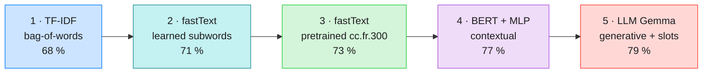

The comparator then shows the **pay-off** with real, measured numbers (not
opinions): on a **paraphrase-heavy** test set, held-out accuracy climbs
**68 % → 71 % → 73 % → 77 % → 79 %** across the five engines, and the LLM
additionally extracts structured **slots** (urgency, type of asset) that no
classifier does. *The 79 % is with `gemma4:e4b-mlx`; the compact default
`gemma3:4b` reaches 70 %, below BERT — the model size matters, see
[Measured results](#measured-results-21-intent-kb-210-example-paraphrase-test-set).* And crucially, it shows the **honest caveats** an ML
practitioner cares about, sampling uncertainty (bootstrap violin plots),
train/test-split variance (k-fold cross-validation), model mis-calibration
(neural nets are over-confident on out-of-scope input), and privacy (why it
all runs locally). The goal is that a non-ML colleague leaves understanding
*why* you would pick one approach over another, which is the judgement this
project exists to transmit.

📊 The detailed, sourced comparison (benchmarks, GDPR, costs): **[`PROS_CONS.md`](PROS_CONS.md)**.
📖 The step-by-step user guide (with screenshots): **[`USERGUIDE.md`](USERGUIDE.md)**.
🍳 The runnable cookbook: **[`EXAMPLES.md`](EXAMPLES.md)**.
📐 The coding standard followed everywhere: **[`CODING.md`](CODING.md)**.

---

## The core idea: knowledge lives in Markdown

**One `# h1` heading = one intent.** A domain expert adds an intent by writing
Markdown in `knowledge_base/`, **without touching any code**:

```markdown
# declarer_sinistre_auto

> **Titre** : Déclarer un sinistre automobile
> **Service** : Gestion des sinistres auto
> **Action** : route:sinistres_auto

## Exemples
- J'ai eu un accident de voiture
- Mon pare-brise est fissuré
- On m'a rentré dedans au feu rouge

## Réponse
Je vous mets en relation avec le service sinistres auto…
```

The `## Exemples` are the **training data** for TF-IDF and BERT, and the
**few-shot** examples for the LLM. The `## Réponse` is the scripted answer read
back. Full format: [`knowledge_base/_FORMAT.md`](knowledge_base/_FORMAT.md).

---

## Install

Requirements: **Python ≥ 3.10**. For the LLM engine (and the BERT embedding
fallback), a local **Ollama**.

### 1. Ollama (for the LLM engine)

- macOS 🍎 : `brew install ollama` (install `brew` via [brew.sh](https://brew.sh/)), then `ollama serve`
- Ubuntu 🐧 : `curl -fsSL https://ollama.com/install.sh | sh`
- Windows 🪟 : `winget install Ollama.Ollama`

Then pull the models:

```bash
ollama pull gemma4:e4b-mlx      # LLM engine — best accuracy (79 %, ~5 s/call warm)
ollama pull nomic-embed-text    # embedding fallback for the BERT engine
```

> **Compact alternative:** `ollama pull gemma3:4b` is smaller and faster (~3 GB vs ~9 GB)
> but scores 70 % — below BERT's 77 %. Use it if disk/RAM is tight; swap back with
> `INTENT_LLM_MODEL=gemma4:e4b-mlx` when you want the top result.

### 2. The project

```bash
python -m venv .venv
source .venv/bin/activate         # Windows 🪟 : .venv\Scripts\activate
pip install -r requirements.txt   # demo: TF-IDF + fastText + LLM
```

**Full dev environment** (tests, lint, BERT engine):

```bash
pip install -r requirements.txt -r requirements-dev.txt
```

**Optional extras:**

```bash
# Pretrained fastText engine: download cc.fr.300 (~4.5 GB compressed, ~7 GB on disk):
python scripts/download_fasttext.py
```

> The demo **degrades gracefully**: without `sentence-transformers`+`torch` the
> BERT engine is unavailable; without `cc.fr.300.bin` the pretrained-fastText
> engine is hidden; without Ollama the LLM engine is hidden. TF-IDF and
> fastText-custom always run.

---

## Quickstart

### The web app (the nice front end)

```bash
./start.sh                        # or: uvicorn intent_engine.api:app --port 8000
# then open http://localhost:8000
```

Type a request, pick an engine (or **Compare all**), and see the five engines'
predictions side by side with confidence bars, latencies, extracted slots and
the routed action. Browse the knowledge base to try example phrases.

### Command line

```bash
python -m intent_engine intents                       # list the intents
python -m intent_engine compare "j'ai eu un accident, ma voiture est cabossée"
python -m intent_engine classify --engine tfidf "je veux résilier"
python -m intent_engine execute "il me faut une prise en charge pour l'hôpital"
```

Example `compare` output (on a paraphrase, note how the lexical engines fall
apart while the semantic ones hold):

| Engine | Prediction | Confidence | CPU / call |
|--------|-----------|:----------:|-----------:|
| `tfidf` | *(abstains)* |, | ~50 ms |
| `fasttext_custom` | `declarer_sinistre_auto` | 0.33 | ~33 µs |
| `fasttext_pretrained` | *(abstains)* |, | ~250 µs |
| `bert` | `declarer_sinistre_auto` | **0.98** | ~20 ms |
| `llm` | `declarer_sinistre_auto` | **0.95** | ~4.7 s |

The LLM also extracts **slots** (`type_bien: auto`, `urgence: haute`) which no
classifier does. The two lexical engines abstain or barely clear the bar on this
paraphrase; the semantic ones are confident. *That* is the lesson in one query.

---

## Measured results (21-intent KB, 210-example paraphrase test set)

Reproducible with `python -m eval.harness` (accuracy/latency) and
`python -m eval.crossval` (bootstrap + cross-validation distributions).

The held-out test set is deliberately **paraphrase-heavy** (low lexical
overlap with the training phrasings), so it measures *generalisation*, not
vocabulary memorisation, which is exactly where the representation shows its
worth:

> ⏱️ **Read latencies as orders of magnitude, not benchmarks.** They were
> timed on a busy dev Mac (other apps running), so the *accuracy* numbers are
> the reproducible, seeded ones (bootstrap + CV); the millisecond/second
> figures just convey the ~4-orders-of-magnitude spread TF-IDF → LLM.

| # | Engine | Accuracy | CPU / call | Slots |
|---|--------|---------:|-----------:|:-----:|
| 1 | <span style="color:#007AFF">TF-IDF + Random Forest</span> | 68 % | ~50 ms | ❌ |
| 2 | <span style="color:#1D8C8D">fastText (learned)</span> | 71 % | ~33 µs | ❌ |
| 3 | <span style="color:#28CD41">fastText (pretrained)</span> | 73 % | ~250 µs | ❌ |
| 4 | <span style="color:#AF52DE">BERT (SBERT + MLP)</span> | 77 % | ~20 ms | ❌ |
| 5 | <span style="color:#FFCC00">qwen2.5:3b · zero shot</span> | 63 %¹ | ~2 s | ✅ |
| 6 | <span style="color:#FF9500">qwen2.5:3b · few shots</span> | 64 %¹ | ~2 s | ✅ |
| 7 | <span style="color:#FF8AC4">gemma3:4b · zero shot</span> | 68 %¹ | ~5 s | ✅ |
| 8 | <span style="color:#FF3B30">gemma3:4b · few shots</span> | 70 %¹ | ~5 s | ✅ |
| 9 | <span style="color:#5856D6">**gemma4:e4b-mlx · few shots**</span> | **79 %¹** | ~5 s | ✅ |

<sup>**Slots** = structured fields extracted alongside the intent (urgency, type of asset, contract number…), ready for a downstream CRM/IVR; only the generative LLM does this. The four classifier scores are skore's raw argmax accuracy on the **held-out 210 paraphrases** (no abstention); ¹ the LLM configs are scored on the **same 210** with their natural JSON output (gemma4:e4b full run 210/210; others 210/210 too). Colours match every figure in this repo.</sup>

> **A latency surprise worth noticing.** The *classic* `TF-IDF + Random Forest`
> (~50 ms) is actually the **slowest non-LLM engine** : the forest's hundreds of
> trees cost more than BERT's two-matmul MLP head (~20 ms) or fastText's vector
> lookup (~33 µs). "Old-school" doesn't mean "fast", and "neural" doesn't mean
> "slow": measure, don't assume. (CPU time via `process_time`, immune to other
> apps' load, see `eval/bench.py`; the LLM figure is Ollama's own compute.)

**The distributions, not just the point estimates.** The four *trainable*
classifiers get a **repeated 5-fold cross-validation**: 5 folds × 5 shuffles =
**25 real measurements** each (train on 4/5 of the K = 21 intents / N = 1008
examples, test on the held-out 1/5), scored by **skore** and drawn as smooth
**violins**. The LLM configs are zero-shot (nothing is trained), so each is a
*single* held-out accuracy — a **Dirac** drawn as one horizontal line. Each
engine keeps the colour it carries in the results table above and in every other
figure of this repo:

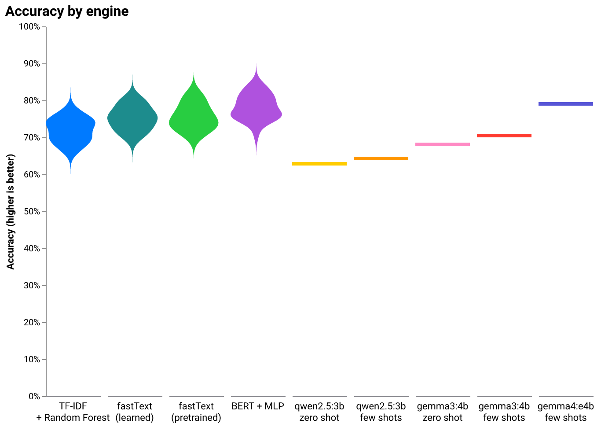

> **Two lenses, one honest story.** On the paraphrase set above, held-out
> accuracy climbs 68 → 71 → 73 → 77 % for classifiers 1→4. Under
> **cross-validation** on the in-distribution KB examples the same order holds
> (72 → 75 → 76 → 78 %), a little higher because the folds look more like their
> training text: lexical methods do fine when the test resembles the training,
> and lose the most under paraphrase shift — which is the whole reason semantic
> representations exist.
>
> Out-of-scope safety net: on 15 off-topic inputs (weather, maths, cooking…),
> TF-IDF abstains ~93 % of the time; the neural BERT is more over-confident
> (~73 % after tuning its threshold), a real lesson on **neural-net
> calibration**. Full analysis + sources in [`PROS_CONS.md`](PROS_CONS.md).
>
> **Model size matters.** The compact `gemma3:4b` lands at **70 %** — below
> BERT's 77 %. A bigger model reclaims the lead: `gemma4:e4b-mlx` reaches
> **79 %** (row 9 in the table, full 210-phrase run), edging past BERT at a
> real cost of seconds per call versus BERT's ~20 ms. `gemma4:12b-mlx` scores
> ~78 % (166/210 phrases; treat as a lower bound). The small model was simply
> *under-sized*; the hierarchy holds. Pick by need (`INTENT_LLM_MODEL` swaps
> the model at runtime). *Margins a few points: read the ranking, not the
> decimals.*

### Where does each engine go wrong? Confusion matrices

An accuracy number hides *how* an engine fails. Each heatmap counts, for every
true intent (rows), which intent the engine predicted (columns), plus an
`Abstain` column for the "hand off to a human" cases. The diagonal is where the
engine is right; off-diagonal cells are its confusions. Every matrix wears its
engine's own colour (white to colour). Read them in order and the diagonal
sharpens: the lexical engines scatter and lean hard on `Abstain`, BERT lands a
near-clean diagonal, and the LLM configs sharpen further with a better model and
few-shot examples.

| | |
|---|---|
| 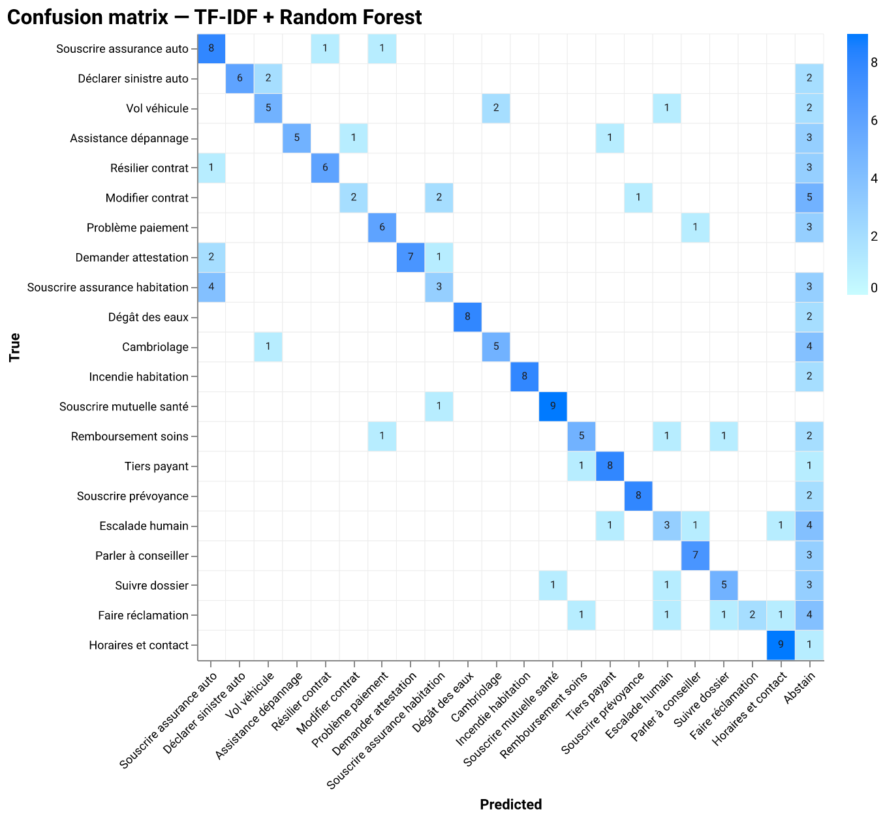 | 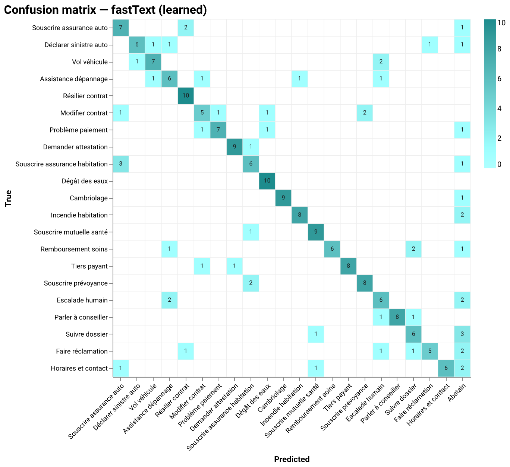 |
| 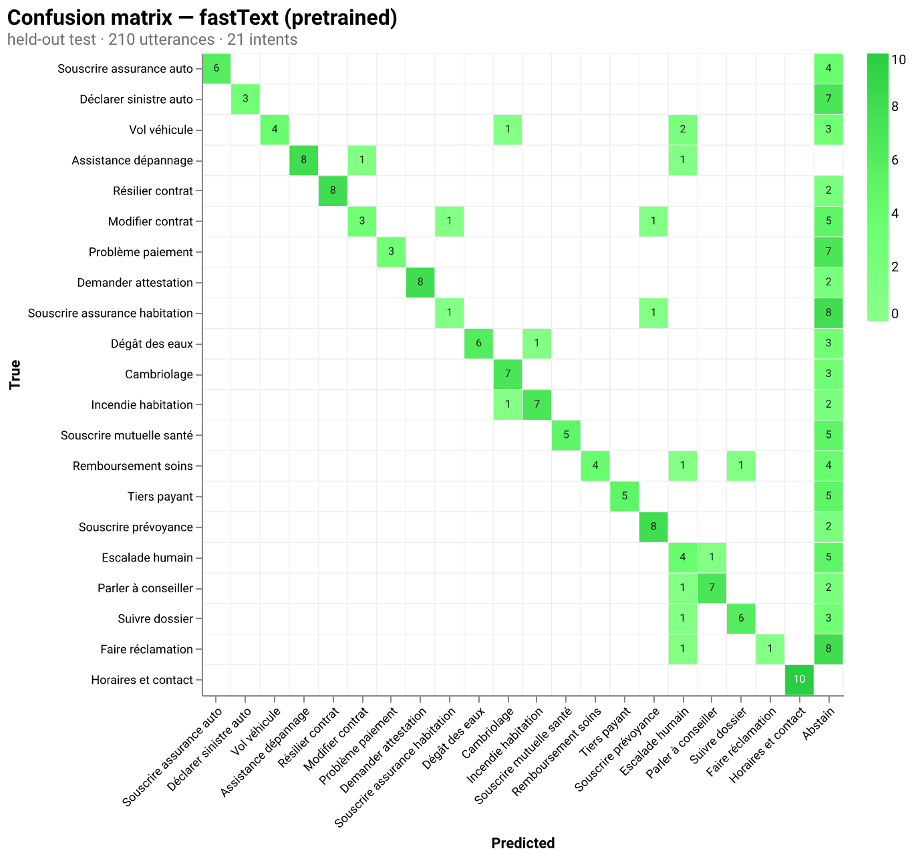 | 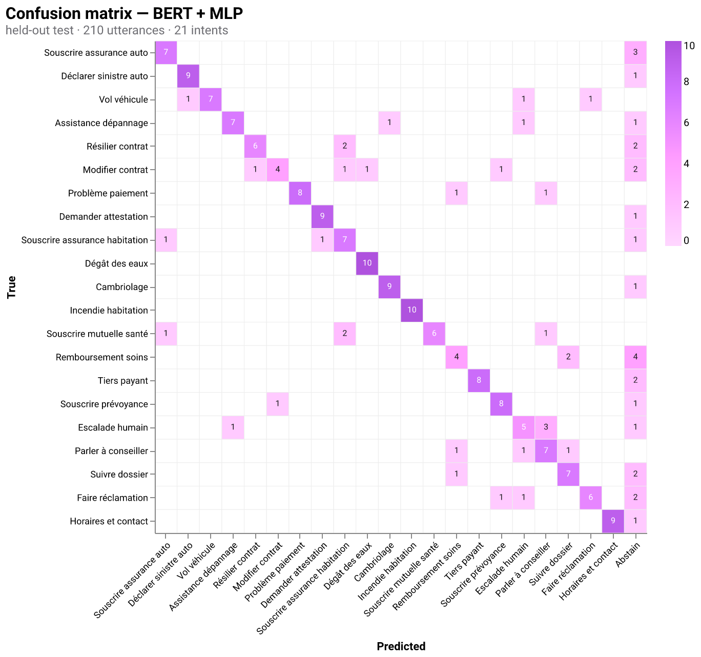 |
| 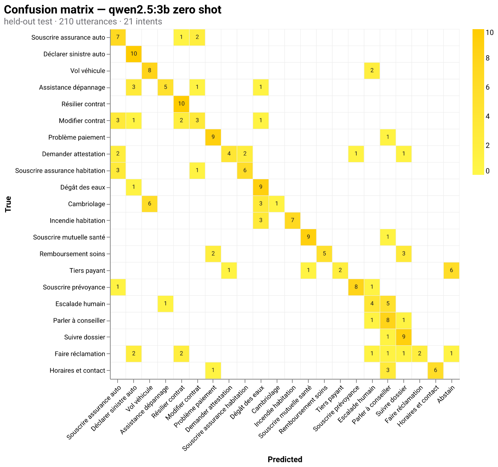 | 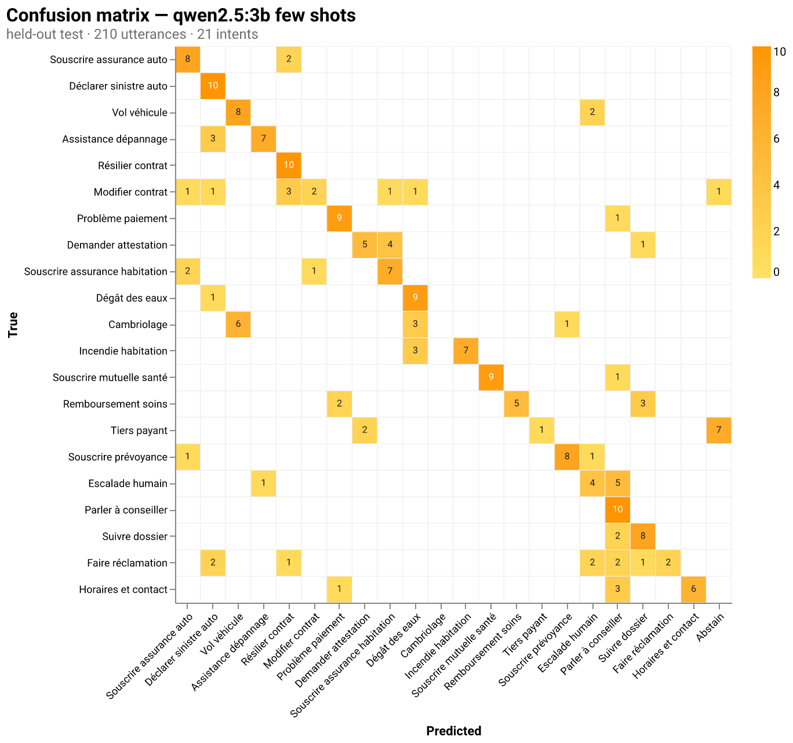 |
| 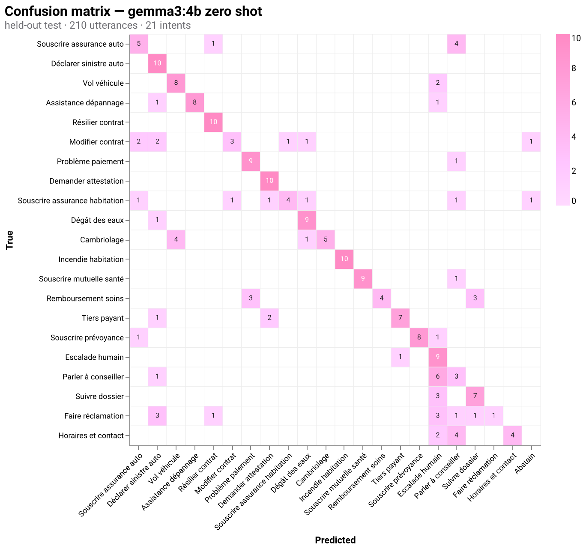 | 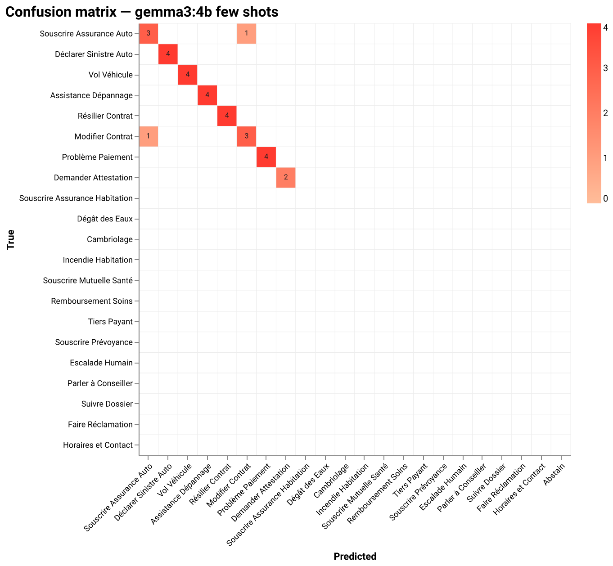 |

Regenerate all eight with `python -m eval.confusion`.

### Bigger model, or a few examples? LLM progression

The *representation* lesson above is about the classifier. This one is about the
**LLM**: the **model size** (a small `qwen2.5:3b` → a mid-size `gemma3:4b` →
a bigger `gemma4:e4b-mlx`) and the **examples** (zero-shot vs few-shot, on
*fresh* sentences never in the test set — no leakage), at a fixed, engineered
prompt:

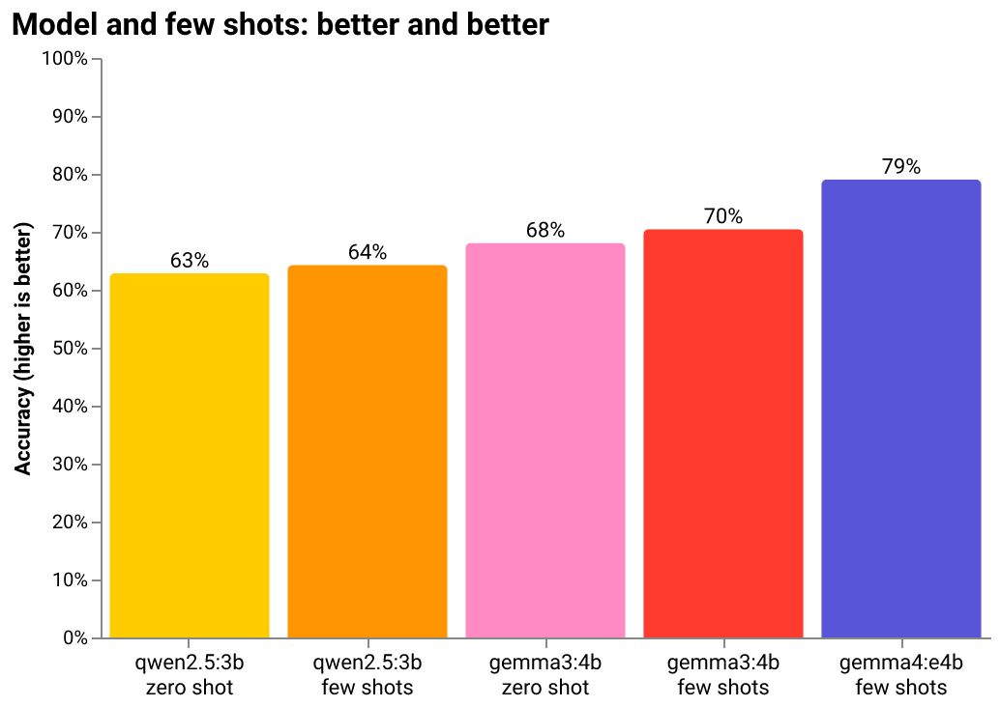

> **The model buys the jump; few-shot adds a little on top; and a bigger model
> rewrites the story.** Accuracy climbs **63 → 64 → 68 → 70 → 79 %**:
> going from the small model to the mid-size one is the first big move, few-shot
> adds a point or two, and upgrading to `gemma4:e4b-mlx` crosses BERT's 77 % by
> two clear points. The practitioner's takeaway: *reach for a stronger model
> first, then squeeze the last points with well-chosen examples.* (Scored on the
> full 210 held-out; predictions cached per config in `eval/.llm_shootout/`.)

---

## Architecture

The Markdown knowledge base feeds every engine; all five implement the same
`IntentEngine` contract, so the router, API, CLI and front end treat them
identically. Only the **representation + classifier** changes.

```mermaid
flowchart LR
    KB["📄 knowledge_base/<br/>Markdown, h1 = intent"] --> Engines

    subgraph Engines["Five engines — same IntentEngine contract"]
        direction TB
        E1["1 · TF-IDF · Random Forest"]
        E2["2 · fastText · learned"]
        E3["3 · fastText · pretrained"]
        E4["4 · BERT · SBERT + MLP"]
        E5["5 · LLM · Gemma · JSON"]
    end

    Engines --> R["router.py<br/>registry · compare · execute"]
    R --> API["api.py · FastAPI"]
    R --> CLI["cli.py · terminal"]
    API --> WEB["web/ — vanilla JS + Tailwind"]

    style KB fill:#FFEACC,stroke:#FF9500,color:#1C1C1E
    style R fill:#F8F8F8,stroke:#808080,color:#1C1C1E
    style E1 fill:#CCE4FF,stroke:#007AFF,color:#1C1C1E
    style E2 fill:#C4F1F1,stroke:#1D8C8D,color:#1C1C1E
    style E3 fill:#D4F5D9,stroke:#28CD41,color:#1C1C1E
    style E4 fill:#EFDCF8,stroke:#AF52DE,color:#1C1C1E
    style E5 fill:#FFD8D6,stroke:#FF3B30,color:#1C1C1E
    style API fill:#CCE4FF,stroke:#007AFF,color:#1C1C1E
    style CLI fill:#CCE4FF,stroke:#007AFF,color:#1C1C1E
    style WEB fill:#CCE4FF,stroke:#007AFF,color:#1C1C1E
```

Key modules: `kb.py` (parser), `base.py` (contracts), `tfidf_engine.py`,
`fasttext_engine.py`, `embeddings.py` + `mlp.py`, `bert_engine.py`,
`llm_engine.py` + `ollama_client.py`, `router.py`, `api.py`, `cli.py`;
`eval/` holds the datasets, harness, `crossval.py`, `violin.py` and the
DeepEval/Giskard integrations.

---

## Tests & evaluation

```bash
pytest -m "not slow"                   # fast suite (deterministic, no network)
pytest                                 # full suite (real BERT/fastText + Ollama)
python -m eval.harness                 # accuracy/latency of all five engines
python -m eval.crossval                # bootstrap + k-fold distributions
python -m eval.violin                  # render the violin plot to docs/img/
```

The evaluation layer (coding standard rule 14) ships a **labelled dataset**
(`eval/dataset.jsonl`), an **out-of-scope set** (`eval/dataset_oos.jsonl`),
**versioned thresholds** (`eval/thresholds.py`), a dependency-free **harness**,
a **statistical base** (`eval/crossval.py`: bootstrap CIs + k-fold CV) with
**violin plots** (`eval/violin.py`), and **DeepEval** (LLM) + **Giskard** (ML)
integrations enabled by `pip install ".[eval]"`. See the testing strategy in
the [`eval/`](eval/) modules and their docstrings.

---

## Privacy

The **intent engine** runs **locally** (scikit-learn, self-hosted fastText &
SBERT, LLM via Ollama): the text of a request never leaves the machine, a
deliberate choice, because in insurance a single sentence can be **sensitive
health data** under GDPR art. 9. *"Il me faut une prise en charge pour l'Institut
de cancérologie"* reveals a cancer diagnosis; sending it to a cloud LLM would
exfiltrate exactly the data the law protects most. Here it stays on the box.

Details and the GDPR discussion in [`PROS_CONS.md`](PROS_CONS.md).


