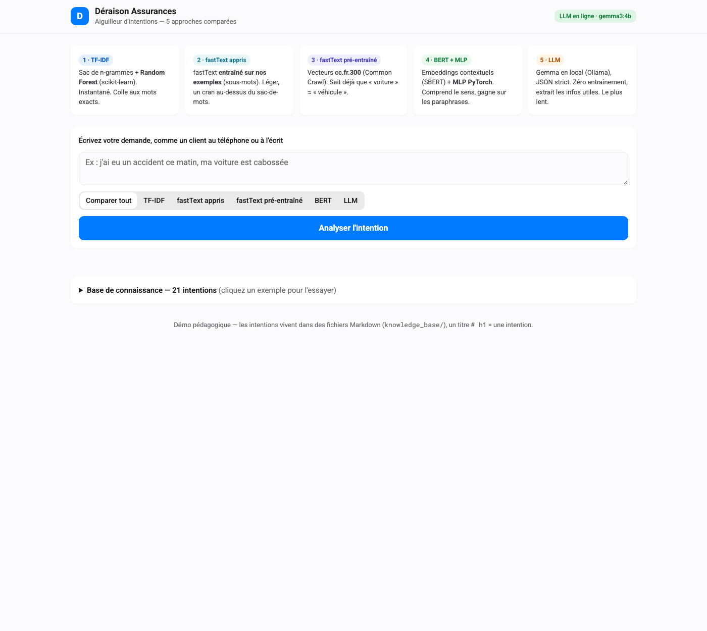
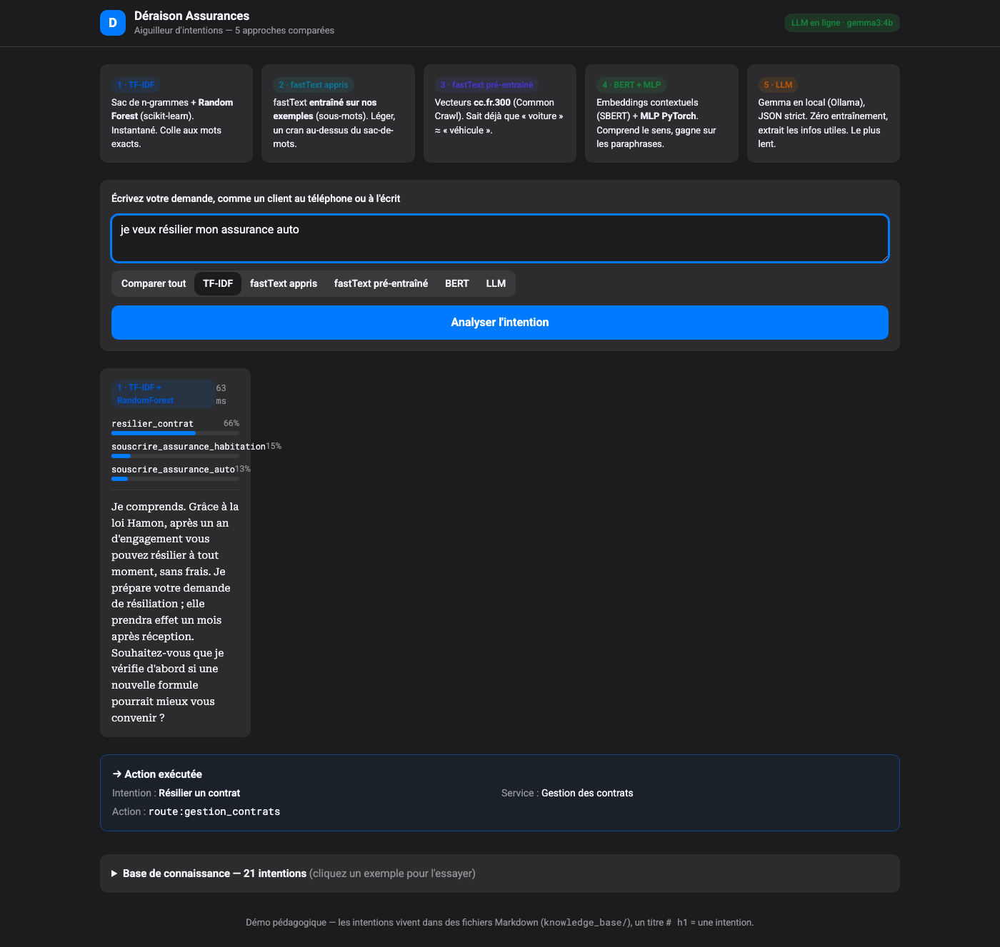
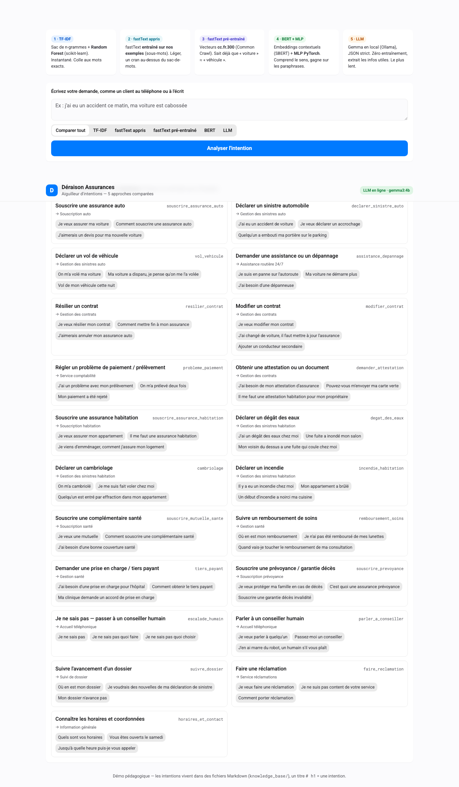

# User Guide — Déraison Assurances intent engine

[🇫🇷 MODEDEMPLOI](MODEDEMPLOI.md) · [🇬🇧 USERGUIDE](USERGUIDE.md) — 🏠 [🇫🇷 LISEZMOI](LISEZMOI.md) · [🇬🇧 README](README.md)

A hands-on walkthrough of the demo: the web app, the CLI, and how to read the
results. For install and architecture, see
[`README.md`](README.md); for the approach comparison, [`PROS_CONS.md`](PROS_CONS.md).

> The UI is in French (it is a French insurance assistant). This guide explains
> every screen in English.

---

## 1. Start the app

```bash
./start.sh                 # or: uvicorn intent_engine.api:app --port 8000
```

Open <http://localhost:8000>. You land on the home screen:



Top to bottom:
- **Header** — the brand, and a badge that honestly reports the LLM engine
  state: green *"LLM en ligne · gemma3:4b"* when Ollama answers, grey
  *"LLM hors ligne"* otherwise (the LLM button is then disabled).
- **Five cards** — a one-line reminder of each approach (TF-IDF, fastText×2, BERT, LLM).
- **Input area** — a text box, an engine selector, and the **Analyser
  l'intention** button.

---

## 2. Ask something

Type a customer sentence — as if heard on the phone — e.g.
*"j'ai eu un accident ce matin, ma voiture est cabossée"*.

Pick a mode with the segmented control:
- **Comparer tout** (default) — run all engines side by side.
- **TF-IDF** / **BERT** / **LLM** — run a single engine.

Press **Analyser l'intention**.

### Reading the comparator


Each engine gets a card showing:
- its **coloured chip** (blue, teal, indigo, green, orange) and its
  **latency** (top-right) — note TF-IDF in ~1 ms vs the LLM in ~5 s (gemma3:4b);
- **confidence bars** for the top intents (the id + a percentage);
- the **scripted answer** for the winning intent, in serif;
- for the LLM, the **extracted slots** (e.g. `urgence: haute`) as small badges.

Below the cards, the **Action exécutée** box shows the concrete routing a
downstream system (CRM, phone system) would receive: intent, department,
machine action, and slots.

---

## 3. The "I don't know" safety net

If no engine is confident enough, the assistant **does not guess**. It says so
plainly and escalates to a **human agent** (not the AI). You will see:

> → Je ne sais pas — transfert à un conseiller humain

This is intentional: in insurance, a confident wrong answer is worse than an
honest handoff. Customers can also trigger it directly by saying *"je ne sais
pas"*, *"je suis perdu"*, or *"aucune de vos options ne me convient"* — these
map to the dedicated `escalade_humain` intent.

---

## 4. Dark mode

The UI follows your system appearance automatically (light or dark):



---

## 5. Browse the knowledge base

At the bottom, expand **Base de connaissance** to see every intent, its target
department, and example phrases. **Click any example** to drop it into the input
box and try it instantly.



Remember: this list is generated from the Markdown files in `knowledge_base/`.
Add a `# h1` heading there and it appears here — no code change.

---

## 6. Command line

Everything the web app does is available in the terminal, handy for a live demo:

```bash
python -m intent_engine intents                       # list the intents
python -m intent_engine compare "je veux résilier mon assurance"
python -m intent_engine classify --engine bert "ma vitre est cassée"
python -m intent_engine execute "il me faut une prise en charge hôpital"
```

---

## 7. Troubleshooting

| Symptom | Fix |
|---|---|
| Badge says *"LLM hors ligne"* | Start Ollama (`ollama serve`) and `ollama pull gemma3:4b`. The rest of the app still works. |
| BERT is slow / different | Without `sentence-transformers` it uses the Ollama embedding fallback. `pip install "sentence-transformers>=3.0.0"` for the SBERT path. |
| Port already in use | `PORT=9000 ./start.sh` or pass `--port 9000` to uvicorn. |

---

## 8. Where to go next

- [`README.md`](README.md) — install, architecture, measured results.
- [`PROS_CONS.md`](PROS_CONS.md) — sourced comparison of the five approaches.
- [`EXAMPLES.md`](EXAMPLES.md) — Python + HTTP + CLI recipes.
- [`knowledge_base/_FORMAT.md`](knowledge_base/_FORMAT.md) — how to add an intent.
